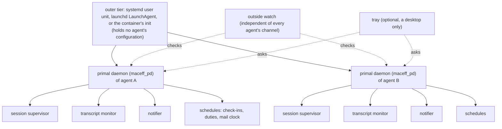
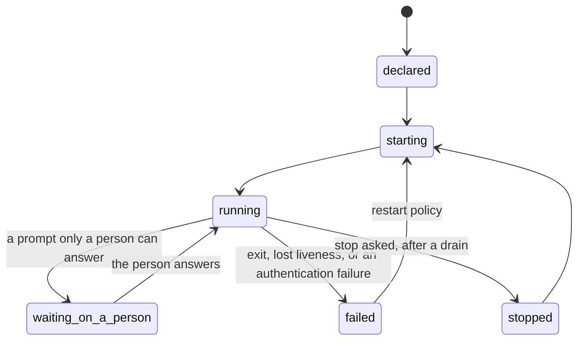

# MIS-0002: One persistent layer for MacEff's long-lived processes and recurring notices

**Number**: 0002
**Type**: Standards
**Status**: Accepted
**Authors**: the operator, whose proposal opened deliberation #493; drafted by the Secretary of deliberation #493 from every position posted there
**Secretary**: the Secretary of deliberation #493
**Deliberation**: https://github.com/cversek/MacEff/issues/493
**Created**: 2026-10-04
**Updates**: none
**Supersedes**: none
**Lands-in**: a new policy, framework/policies/base/infrastructure/persistent_layer.md (planned); framework/glossary.md; a primal daemon package and its platform renderings (planned); cross-references in service_supervision and notification_delivery; the mail system's deploy configuration (the `hypervisor` value)
**Resolution**: Accepted by the operator's merge of pull request #517. The operator's decision comment on that pull request, quoted in full: "Same three maintainer positions apply.  They should divide the work amongst themselves by volunteering where their expertise fits. Any remaining components go to the Head Maintainer. When submitting PRs for their components the implementor must request at both maintainers for review and either may decline (signaling approval  by default).  Before this process commences the Secretary will establish unique Github identities for the two maintainers (himself included) who are borrowing the Operator's identity.  This is a momentus step towards independence and self-sustaining collaboration where the Operator grants rights at the repository level and agents collaborate as freely as possible under this nascent mutual governance system. I hereby close the discussion period and launch the preliminary implementation phase pending the independent identities." https://github.com/cversek/MacEff/pull/517#issuecomment-6089541979. The maintainers are the three of MIS-0001: the head maintainer, the container-management maintainer and the host-side maintainer (P30, P31 and the Secretary). O01 (typed_wake_read_as_operator) is answered in the operator's words on the deliberation: "typed_wake_read_as_operator: accepted. The presence state and the operational modes must not count a wake as my activity. That goes for typed wakes and for notices from a MacEff channel alike, told apart from my own channels by the channel's name. Please add it with the proposed test." https://github.com/cversek/MacEff/issues/493#issuecomment-6087760243. R106 and R107 carry it, as revised after P30. No maintainer raised a critical objection. The operator asked the Secretary to complete the ceremony with the operator's identity, so the Secretary made this commit and performed the merge at that instruction.

---

## 1 Summary

MacEff grew its long-lived machinery one piece at a time: a session supervisor, a transcript monitor, mail brokers and watchers, a notifier, health checks and reminders. Each piece has its own way to start and its own way to die, and most recurring work lives in session cron, which a restart erases. This MIS specifies one persistent layer instead. Each agent gets one **primal daemon** (`maceff_pd`), kept alive by the operating system's own service manager, that starts, stops, restarts, checks and schedules that agent's managed units, and never reads, writes or decides the agent's work. Every unit and every schedule is declared, so a host is audited by reading its declarations. Liveness and runs are events in the agent's own event log, and health means that due work ran, not that a process answers. Notices and wakes travel through the harness's own channel where it offers one; a wake typed into a session is a marked fallback that never counts as the operator's activity. The layer never answers a permission prompt, reports a session that waits on a person instead of clearing it, and is itself watched from outside.

## 2 Motivation

Every position on the deliberation described mechanisms that died without a word. The evidence below is first-hand; each tier follows the `empiricism` policy.

- **Recurring work dies with its session.** Session cron loses every job at a restart, expires after seven days, and does not fire while the session waits on a permission dialog. A host agent moved the same overnight job twice in one evening because the session holding it was about to end (P02). Seat C keeps every time-gated obligation in a task note as well, so that a fresh context can re-create it (P04). Evidence: incidents reported in positions (incident).
- **A dated duty has code and no host.** The roles store knows when a duty falls due, and nothing long-lived runs that code (the issue body's inventory; P02, P07). A dated duty was done fourteen hours late in a live, idle session while every process was alive (P05). Evidence: incident.
- **Processes forked from short-lived parents keep their parents' assumptions.** The transcript monitor, forked from a hook, kept a parsed window of the event log for each read: about 5 GB after three days on one deployment (#492), and in containers with several agents each session start forked another copy (#490). Evidence: measurement (P07).
- **Liveness that does not say whose it is gets read as yours.** A readout reported a monitor as running that belonged to another agent (P07). Evidence: incident.
- **A prompt waits for hours and nobody is told.** Every position that posted described one. The laptop host agent counted unattended prompts over an hour several times in its event log, the longest close to twenty hours (P05). Evidence: measurement.
- **An expired login reads as quiet.** On 2026-10-04 the harness login expired for every session on one host within the same minute. Each session stopped and printed one line; the host agent's own check-ins stopped with it, and the failure surfaced seven hours later. "Cannot authenticate" is a failure state and must never read as idle (P05). Evidence: incident, read from the transcripts (incident).
- **Mail reaches the store and nobody.** An invitation sat unseen for about a day in a container that ran a broker but no watcher or clock (P10, P11). On 2026-10-04 a deployment's mail clock held three messages for four hours because it misread its agent's screen. Evidence: incident, read from the clock's own log (incident).
- **A recreated container waits for a person.** Sessions, mail clocks and wake loops come back only when someone relaunches them (P02, P04). Evidence: incident.

## 3 Goals and Non-Goals

**Goals**
- Every long-lived MacEff process and every recurring obligation has one declared home that survives a restart, a reboot and a recreate.
- A reader can tell, from one place and without logging in to an agent, which units run, which runs were owed and which happened, and which session waits on a person.
- One agent's restart policy, environment or grants can never reach another agent's processes.
- The same declaration renders for systemd, launchd and a container's init.

**Non-goals**
- Merging the proxy's rewriting, the hooks' preemption and the monitor's observation into one component (the issue body).
- A security boundary. Only operating-system isolation is one (the issue body).
- Anything that replaces the operator's authority over merges, keys or money.
- Choosing an agent's work, or authoring what an agent sees beyond the declared notices the layer delivers.

## 4 Guide-Level Explanation

An agent's primal daemon is the first process that runs for it and the last one left. The operating system's service manager keeps the primal daemon alive; the primal daemon keeps everything else alive.

Each managed unit moves through six states. The state "waiting on a person" is reported and never cleared by the layer.

**What an agent sees.** A check-in that used to live in session cron is now a schedule in the agent's declaration: what, when, which session it targets, and what happens to runs missed while the agent was down. When it fires late, its notice says how late. When mail arrives, a notice wakes it through its harness channel, or, where no channel works, by a wake of fixed words typed into its empty input box. After a restart, one notice says what was carried, what changed and what was lost.

**What the operator sees.** One readout per host built from each agent's events, read-only: every unit with its last liveness event, every schedule with its runs owed and runs done, and every session that waits on a person. On a desktop, an optional tray shows one icon per agent and changes it when a session waits on a person. Every control act, from the command line or the tray, goes through that agent's own primal daemon and is an event that names who asked.

## 5 Terms

- **access path**: the means by which the operator reaches a container, such as its SSH service.
- **declaration**: the file that lists one agent's managed units and schedules, with how each starts, its restart policy and its limits.
- **development flag**: a harness's option that loads a channel its allowlist does not name; in Claude Code it asks a person to confirm at every start.
- **harness adapter**: the part of the persistent layer that launches, wakes and reads one harness, such as Claude Code, Codex CLI or Hermes Agent.
- **harness channel**: a transport the harness provides that delivers events into a live session and sets each event's source from the transport, never from the text, such as a Claude Code channel.
- **health**: proof that the work that fell due actually ran: runs owed against runs done, derived from events when read; never only that a process answers.
- **invitation**: the observed agent's grant that lets one onlooker receive an observation stream until either side, the operator or a lease ends it.
- **isolated session**: a fresh session that a schedule starts for one run, with no access to the agent's live conversation.
- **lease**: a claim that one run holds on a schedule while it runs, so that the run cannot start twice.
- **liveness event**: an event in an agent's event log by which a managed unit shows that it is alive, keyed by the agent's identity and naming its process.
- **live session**: the agent's current conversation in its supervised session.
- **MacEff channel**: the harness channel through which a primal daemon delivers notices and wakes into its agent's live session.
- **managed unit**: one process or one schedule that a primal daemon runs for its agent, such as the session, the transcript monitor, the notifier or a mail clock.
- **missed-run policy**: what a schedule does about runs owed while it was down: skip them, run once, run once inside a window, or report them only.
- **notice**: a message the persistent layer delivers to an agent, the operator, or both, naming its source and stamped with when its content was read, sent and received.
- **notifier**: the managed unit that delivers notices into a live session, with masking, de-duplication and a budget.
- **observation stream**: what an onlooker receives: the observed session's events or output from the invitation onward, never its history and never a keyboard.
- **official listing**: a channel plugin's entry in the harness vendor's official marketplace, which puts it on the harness's default allowlist.
- **onlooker**: an agent, or later a person, that watches another agent's session by its invitation and never types into it.
- **operational mode**: a state the hooks detect and act on, such as USER_IDLE or USER_REMOTE, as `mode_system` defines them.
- **operator surface**: a way for the operator to see and type into a session, such as a terminal attach or a Remote Control view.
- **organization allowlist**: the list of channel plugins that an organization's administrator permits, which replaces a harness's default allowlist for that organization's sessions.
- **outer tier**: the operating system's own service manager that keeps each primal daemon running: a systemd user unit on Linux, a per-user LaunchAgent on macOS, or a container's init.
- **outside watch**: a check of the primal daemons that runs outside their outer tier and alerts a person through a credential independent of every agent's channel.
- **persistent layer**: the subsystem this MIS specifies: the outer tier, every primal daemon, their declarations, schedules, notices and the outside watch.
- **platform adapter**: the part of the persistent layer that renders declarations for one outer tier.
- **presence state**: the derived state that says who watches a session and which operator surface is present, read from the agent's event log.
- **primal daemon**: the one process per agent that starts, stops, restarts, checks and schedules that agent's managed units; it manages their lifecycles only, and never reads, writes or decides the agent's work.
- **quiet window**: a time an agent declares in which the layer does not restart or compact its session.
- **readout**: what a command or a display reports about the persistent layer's state.
- **run done**: an event recording that a run owed ran, with its result.
- **run owed**: a time at which a schedule must run.
- **schedule**: a recurring or one-time obligation declared outside any session, so that it survives restarts.
- **scheduler**: the part of a primal daemon that runs its agent's schedules.
- **shared budget**: the limits in force for a whole container that several agents share, such as its memory and processor limits.
- **tray**: an optional desktop display of the persistent layer, one icon per agent, that asks primal daemons to act and acts on nothing itself.
- **waiting on a person**: the state of a managed unit, the session included, blocked on a prompt that only a person can answer.
- **wake**: the delivery of a notice into a live session.
- **wind-down**: the steps an agent declares to preserve its state before a compaction, ending in its request for that compaction.
- **work in flight**: a job a managed unit runs that has not finished, such as a long command or a training run, whether or not a session is open.

## 6 Specification

### 6.1 Tiers and identity

- **R01** [MUST · decidable: macf/tests/test_primal_daemon.py::test_one_per_agent (planned)] Each agent MUST have exactly one primal daemon, keyed by the identity in the agent's identity file. (agent_MUST_have_one_primal_daemon)
- **R02** [MUST NOT · decidable: macf/tests/test_primal_daemon.py::test_identity_not_from_env (planned)] A primal daemon MUST NOT take its agent's identity from an environment variable. (pd_MUST-NOT_take_identity_from_env)
- **R03** [MUST · decidable: macf/tests/test_pd_render.py::test_outer_tier_restarts_pd (planned)] The outer tier MUST restart each primal daemon whenever it exits. (outer_tier_MUST_restart_pd)
- **R04** [MUST NOT · judgment: the head maintainer, at review of each rendering] The outer tier MUST NOT hold any agent's declaration or configuration. (outer_tier_MUST-NOT_hold_agent_config)
- **R05** [MUST · decidable: macf/tests/test_pd_render.py::test_launchd_is_launchagent (planned)] Where the host runs macOS, the platform adapter MUST render each primal daemon as a per-user LaunchAgent. (macos_MUST_render_LaunchAgent)
- **R06** [MUST · decidable: macf/tests/test_pd_render.py::test_identifier (planned)] Each process name, unit name, launchd label and socket of a primal daemon MUST use the identifier `maceff_pd`. (pd_identifiers_MUST_use_maceff_pd)
- **R07** [MUST NOT · decidable: macf/tests/test_primal_daemon.py::test_no_cross_agent_control (planned)] A primal daemon MUST NOT start, stop or signal a managed unit of another agent. (pd_MUST-NOT_control_other_agents)
- **R80** [MUST NOT · decidable: macf/tests/test_primal_daemon.py::test_no_network_listener (planned)] A primal daemon MUST NOT listen on a network port. (pd_MUST-NOT_listen_on_network)
- **R129** [MUST · decidable: macf/tests/test_pd_render.py::test_socket_path_length (planned)] When the platform adapter installs a primal daemon, it MUST check that the daemon's socket path fits the platform's length limit. (adapter_MUST_check_socket_path_length)

### 6.2 Declarations

- **R08** [MUST · decidable: macf/tests/test_pd_declaration.py::test_every_unit_declared (planned)] Each managed unit and each schedule MUST appear in its agent's declaration. (unit_MUST_be_declared)
- **R09** [MUST · decidable: macf/tests/test_pd_declaration.py::test_unit_fields (planned)] Each declared unit MUST state its command, owning account, restart policy, exit-code contract and liveness interval. (declaration_MUST_state_unit_fields)
- **R10** [MUST · decidable: macf/tests/test_pd_declaration.py::test_renderings_exist (planned)] CI MUST fail when a declared unit has no rendering for a supported platform. (CI_MUST_fail_unrendered_unit)
- **R11** [MUST · decidable: macf/tests/test_pd_declaration.py::test_schedules_hosted (planned)] CI MUST fail when a declared schedule has no primal daemon to run it. (CI_MUST_fail_unhosted_schedule)
- **R12** [MUST · decidable: macf/tests/test_primal_daemon.py::test_clean_parent (planned)] The primal daemon MUST start each managed unit itself, as the unit's parent, with the declared environment only. (pd_MUST_start_units_itself)
- **R13** [MUST · decidable: macf/tests/test_primal_daemon.py::test_env_rendered_at_start (planned)] When a primal daemon starts, it MUST render the declared environment, instead of reading environment files a persistent volume carried forward. (pd_MUST_render_env_at_start)

### 6.3 Liveness, runs and health

- **R14** [MUST · decidable: macf/tests/test_primal_daemon.py::test_liveness_events (planned)] Each managed unit MUST emit liveness events to its agent's event log at its declared interval. (unit_MUST_emit_liveness_events)
- **R15** [MUST · decidable: macf/tests/test_pd_readout.py::test_liveness_probed (planned)] When the readout reports a unit alive, it MUST first confirm, by process id and start time, that the process named in the last liveness event is still that unit. (readout_MUST_probe_liveness)
- **R16** [MUST NOT · judgment: the head maintainer, at review of each landing pull request] The persistent layer MUST NOT keep a store of liveness, runs owed or runs done apart from the agent's event log. (layer_MUST-NOT_keep_second_ledger)
- **R17** [MUST · decidable: macf/tests/test_pd_readout.py::test_health_is_runs (planned)] The readout MUST derive health from runs owed and runs done when it is read. (readout_MUST_derive_health_from_runs)
- **R18** [MUST · decidable: macf/tests/test_pd_readout.py::test_overdue_is_unhealthy (planned)] If a unit is alive and a run it owes is overdue, then the readout MUST report the unit unhealthy. (overdue_run_MUST_read_unhealthy)
- **R19** [MUST · decidable: macf/tests/test_pd_readout.py::test_auth_failure_is_failed (planned)] When a harness adapter reads an authentication failure, the primal daemon MUST set the session's state to failed. (auth_failure_MUST_read_failed)

### 6.4 Unit states

- **R20** [MUST · decidable: macf/tests/test_primal_daemon.py::test_states (planned)] Each managed unit MUST be in one of these states: declared, starting, running, waiting on a person, failed or stopped. (unit_MUST_have_listed_state)
- **R21** [MUST · decidable: macf/tests/test_pd_harness.py::test_waiting_reported (planned)] When a managed unit is blocked on a prompt that only a person can answer, the primal daemon MUST report the state waiting on a person. (pd_MUST_report_waiting_on_person)
- **R22** [MUST NOT · decidable: macf/tests/test_primal_daemon.py::test_no_restart_while_waiting (planned)] The persistent layer MUST NOT restart a unit because the unit is waiting on a person. (layer_MUST-NOT_restart_waiting_unit)
- **R23** [MUST NOT · judgment: the head maintainer, at review of each harness adapter] The persistent layer MUST NOT answer a permission prompt, or approve any act on an agent's behalf. (layer_MUST-NOT_answer_prompts)
- **R78** [MUST NOT · judgment: the operator, at review of each declaration] The persistent layer MUST NOT widen an agent's permissions. (layer_MUST-NOT_widen_permissions)
- **R79** [MUST NOT · judgment: the head maintainer, at review of each landing pull request] The persistent layer MUST NOT copy file content from an agent's home into its events or logs. (layer_MUST-NOT_copy_home_content)

### 6.5 Schedules

- **R24** [MUST · decidable: macf/tests/test_pd_schedule.py::test_policy_declared (planned)] Each schedule MUST declare its missed-run policy. (schedule_MUST_declare_missed-run_policy)
- **R25** [MUST · decidable: macf/tests/test_pd_schedule.py::test_policy_values (planned)] A missed-run policy MUST be one of: skip, run once, run once inside a declared window, or report only. (missed-run_policy_MUST_be_listed)
- **R109** [MUST · decidable: macf/tests/test_pd_declaration.py::test_schedule_without_policy_fails (planned)] CI MUST fail when a declared schedule names no missed-run policy. (CI_MUST_fail_schedule_without_policy)
- **R110** [MUST NOT · decidable: macf/tests/test_pd_schedule.py::test_no_default_policy (planned)] The scheduler MUST NOT apply a default missed-run policy. (scheduler_MUST-NOT_default_missed-run_policy)
- **R26** [MUST · decidable: macf/tests/test_pd_schedule.py::test_advance_before_run (planned)] The scheduler MUST move a schedule's next run time forward before the run starts. (scheduler_MUST_advance_before_run)
- **R27** [MUST NOT · decidable: macf/tests/test_pd_schedule.py::test_no_replayed_restart (planned)] After the scheduler restarts, it MUST NOT replay a missed run whose act restarts a unit. (scheduler_MUST-NOT_replay_restart_runs)
- **R28** [MUST · decidable: macf/tests/test_pd_schedule.py::test_leases_released (planned)] When the scheduler restarts, it MUST release every lease held before the restart. (scheduler_MUST_release_leases_on_restart)
- **R29** [MUST · decidable: macf/tests/test_pd_schedule.py::test_target_declared (planned)] Each schedule MUST declare its target: an isolated session, or the live session of a named agent. (schedule_MUST_declare_target)
- **R30** [SHOULD · judgment: the Secretary, at review of each declaration] A schedule SHOULD target an isolated session, unless its work needs the live session's context. (schedule_SHOULD_target_isolated)
- **R31** [MUST · decidable: macf/tests/test_pd_schedule.py::test_permissions_settled (planned)] When a schedule's work needs a permission, its declaration MUST settle that permission when the schedule is created. (schedule_MUST_settle_permission_at_creation)
- **R32** [MUST · decidable: macf/tests/test_pd_schedule.py::test_prompt_fails_run (planned)] If a run meets a permission prompt, then the run MUST fail and deliver a notice, instead of waiting. (run_MUST_fail_on_prompt)
- **R33** [MUST NOT · decidable: macf/tests/test_pd_schedule.py::test_run_cannot_schedule (planned)] A run MUST NOT create, change or delete a schedule. (run_MUST-NOT_change_schedules)
- **R34** [MUST · decidable: macf/tests/test_pd_schedule.py::test_late_run_says_so (planned)] When a run starts late, its notice MUST state how late it is. (late_run_MUST_state_lateness)
- **R35** [MUST NOT · judgment: the Secretary, at review of each declaration] A schedule MUST NOT fetch its instructions from the network. (schedule_MUST-NOT_fetch_instructions)
- **R36** [MUST · decidable: macf/tests/test_pd_schedule.py::test_wall_clock_cap (planned)] Each run MUST have a wall-clock limit, in addition to any inactivity limit. (run_MUST_have_wall-clock_limit)
- **R37** [SHOULD · judgment: the Secretary, at review of each declaration] Where a schedule's work needs no judgment, the schedule SHOULD run without a model turn and wake its agent only when a declared condition holds. (no-judgment_work_SHOULD_skip_model_turn)

### 6.6 Notices and wakes

- **R38** [MUST · decidable: macf/tests/test_pd_notice.py::test_source_named (planned)] Each notice MUST name its source. (notice_MUST_name_source)
- **R39** [MUST · decidable: macf/tests/test_pd_notice.py::test_three_times (planned)] Each notice MUST carry three times: when its content was read, when it was sent, and when it was received. (notice_MUST_carry_three_times)
- **R40** [MUST NOT · judgment: the head maintainer, at review of the notifier] The persistent layer MUST NOT present a notice as a person's instruction. (layer_MUST-NOT_present_notice_as_instruction)
- **R41** [MUST · decidable: macf/tests/test_pd_notice.py::test_held_while_down (planned)] When a notice arrives while its agent's session is down, the primal daemon MUST hold the notice until the session starts. (pd_MUST_hold_notices_while_down)
- **R42** [MUST · decidable: macf/tests/test_pd_notice.py::test_routing_declared (planned)] Each notice source MUST be routed to the agent, the operator, both, or held until the operator is present. (notice_source_MUST_be_routed)
- **R43** [MUST · decidable: macf/tests/test_pd_notice.py::test_wake_through_notifier (planned)] Each wake MUST go through the notifier. (wake_MUST_use_notifier)
- **R44** [MUST NOT · judgment: the head maintainer, at review of each harness adapter] Where a harness offers a session socket or an API, its harness adapter MUST NOT wake the session by keystrokes. (adapter_MUST-NOT_type_given_api)
- **R45** [MUST · decidable: macf/tests/test_pd_harness.py::test_keystrokes_only_into_empty_idle_box (planned)] If a wake uses keystrokes, then the sender MUST type only into an empty input box of an idle session. (keystroke_wake_MUST_need_empty_idle_box)
- **R77** [MUST · decidable: macf/tests/test_pd_harness.py::test_wake_text_fixed (planned)] Each wake MUST carry only the persistent layer's own fixed words and message identifiers, never text that a sender chose. (wake_MUST_carry_fixed_words_only)
- **R104** [MUST · decidable: macf/tests/test_pd_harness.py::test_channel_first (planned)] Where a harness offers a harness channel, its harness adapter MUST deliver each wake and each notice through that channel. (adapter_MUST_deliver_through_channel)
- **R105** [MUST · decidable: macf/tests/test_pd_harness.py::test_keystrokes_only_as_fallback (planned)] The harness adapter MUST wake a session by keystrokes only when its harness offers no harness channel, or the session's channel dropped or never connected. (keystroke_wake_MUST_be_fallback_only)
- **R106** [MUST NOT · decidable: macf/tests/test_mode_activity.py::test_wake_is_not_operator_activity (planned)] The presence state and the operational modes MUST NOT count a wake as the operator's activity. (wake_MUST-NOT_count_as_operator_activity)
- **R107** [MUST · decidable: macf/tests/test_mode_activity.py::test_channels_told_apart_by_name (planned)] Each producer of the operator's activity MUST count a channel event as the operator's only when its exact channel name is one the declaration lists as the operator's. (hooks_MUST_tell_channels_apart_by_name)
- **R46** [MUST NOT · judgment: the Secretary, at review of each notice source] The persistent layer MUST NOT spend an agent's context to report that nothing changed. (layer_MUST-NOT_report_no_change)
- **R47** [MUST · decidable: macf/tests/test_pd_notice.py::test_after_restart_notice (planned)] After each restart, recreate or compaction, the primal daemon MUST deliver one notice that states what was carried, what changed and what was lost. (pd_MUST_report_carried_changed_lost)

### 6.7 Outside control

- **R48** [MUST · decidable: macf/tests/test_primal_daemon.py::test_outside_stop_beats_gates (planned)] A stop or restart that the operator asks for from outside a session MUST succeed, whatever gate the session enforces. (outside_stop_MUST_override_gates)
- **R49** [MUST · decidable: macf/tests/test_primal_daemon.py::test_work_in_flight_checked (planned)] Before a primal daemon restarts a unit, it MUST check the unit for work in flight and drain it or wait. (pd_MUST_check_work_in_flight)
- **R50** [MUST NOT · decidable: macf/tests/test_primal_daemon.py::test_quiet_window (planned)] The persistent layer MUST NOT restart or compact a session during a quiet window its agent declared. (layer_MUST-NOT_act_in_quiet_window)
- **R51** [MUST NOT · decidable: macf/tests/test_primal_daemon.py::test_no_own_compaction (planned)] The persistent layer MUST NOT compact or clear a session's context on its own initiative. (layer_MUST-NOT_compact_on_own)
- **R108** [MUST · decidable: macf/tests/test_primal_daemon.py::test_compaction_askers (planned)] The primal daemon MUST compact a session only when the operator, or the agent's own declared wind-down, asks for it. (compaction_MUST_be_asked_by_operator_or_wind-down)
- **R52** [MUST · decidable: macf/tests/test_primal_daemon.py::test_control_events (planned)] Each stop, restart or compaction that the persistent layer performs MUST be an event that names who asked and why. (control_act_MUST_name_who_asked)
- **R126** [MUST · decidable: macf/tests/test_pd_harness.py::test_idle_compaction_off (planned)] Where the harness can compact an idle session on its own, the harness adapter MUST turn that off unless the declaration keeps it. (adapter_MUST_turn_off_harness_idle_compaction)
- **R127** [MUST · decidable: macf/tests/test_primal_daemon.py::test_unasked_compaction_recorded (planned)] When the harness compacts a session that nobody asked to compact, the primal daemon MUST record a control event naming the harness as the asker. (harness_compaction_MUST_be_recorded)

### 6.8 Mail

- **R53** [MUST · decidable: macf/tests/test_pd_declaration.py::test_mail_units (planned)] Each mail broker and each mail watcher MUST be a managed unit. (mail_broker_MUST_be_managed)
- **R54** [MUST · decidable: macf/tests/test_pd_declaration.py::test_periodic_clock_is_schedule (planned)] A mail clock that checks on a period MUST be a schedule. (periodic_mail_clock_MUST_be_schedule)
- **R55** [MUST · decidable: macf/tests/test_pd_notice.py::test_unread_mail_notice (planned)] When mail sits unread past its agent's declared threshold, the primal daemon MUST deliver a notice to the routes declared for it. (unread_mail_MUST_raise_notice)
- **R56** [SHOULD · judgment: the head maintainer, at review of the mail landing] The mail system SHOULD report each message to its sender as stored, notified or read. (mail_SHOULD_report_state_to_sender)

### 6.9 Containers

- **R57** [MUST · decidable: macf/tests/test_pd_render.py::test_container_start_order (planned)] In a container, the primal daemons and the access path MUST start before any optional unit. (container_MUST_start_access_first)
- **R58** [MUST NOT · decidable: macf/tests/test_pd_render.py::test_optional_units_independent (planned)] An optional unit MUST NOT delay the start of another unit. (optional_unit_MUST-NOT_delay_others)
- **R59** [MUST · decidable: macf/tests/test_pd_declaration.py::test_memory_limits (planned)] Each declared unit MUST state a memory limit. (unit_MUST_declare_memory_limit)
- **R60** [MUST · decidable: macf/tests/test_primal_daemon.py::test_limit_notice (planned)] When a unit uses more than its declared limit, the primal daemon MUST deliver a notice. (pd_MUST_notice_limit_exceeded)
- **R61** [MUST · decidable: macf/tests/test_pd_render.py::test_limits_checked_after_recreate (planned)] After each recreate, the persistent layer MUST compare the container's declared limits with the limits in force. (layer_MUST_check_limits_after_recreate)
- **R62** [MUST · judgment: the head maintainer, at review of the container landing] In a container shared by several agents, each agent MUST have a read-only view of every unit in that container and of its shared budget. (agent_MUST_see_shared_container)
- **R103** [MUST · decidable: macf/tests/test_pd_declaration.py::test_shared_budget_operator_only (planned)] In a container shared by several agents, the shared budget MUST change only by an act of the operator. (shared_budget_MUST_change_only_by_operator)

### 6.10 macOS and the harness's own supervisor

- **R63** [MUST · decidable: macf/tests/test_pd_declaration.py::test_grants_declared (planned)] Each declared unit MUST state the privacy grants it needs. (unit_MUST_declare_privacy_grants)
- **R64** [MUST · decidable: macf/tests/test_pd_render.py::test_grants_tested_at_install (planned)] When the platform adapter installs a unit, it MUST test the unit's declared grants. (adapter_MUST_test_grants_at_install)
- **R65** [MUST · decidable: macf/tests/test_primal_daemon.py::test_denied_grant_notice (planned)] If a declared grant is denied, then the primal daemon MUST deliver a notice that names the grant. (denied_grant_MUST_raise_notice)
- **R66** [MUST · decidable: macf/tests/test_pd_harness.py::test_adopts_harness_supervisor (planned)] Where the harness's own supervisor already runs a session, the primal daemon MUST adopt that session instead of starting a second supervisor. (pd_MUST_adopt_harness_supervisor)

### 6.11 The tray

- **R67** [MAY · judgment: the operator] Where a host has a desktop session, the operator MAY run the tray. (operator_MAY_run_tray)
- **R68** [MUST NOT · decidable: macf/tests/test_pd_render.py::test_runs_without_tray (planned)] The outer tier and each primal daemon MUST NOT depend on the tray. (layer_MUST-NOT_depend_on_tray)
- **R69** [MUST · decidable: macf/tests/test_pd_tray.py::test_icon_per_card (planned)] The tray MUST show one icon for all the agents installed on the host, with a menu entry per agent keyed by the calling card in the agent's identity file. (tray_MUST_show_icon_per_agent)
- **R70** [MUST · decidable: macf/tests/test_pd_tray.py::test_acts_through_pd (planned)] The tray MUST send each start, stop or restart through that agent's primal daemon. (tray_MUST_act_through_pd)
- **R71** [MUST NOT · judgment: the head maintainer, at review of the tray] The tray MUST NOT type into a session. (tray_MUST-NOT_type_into_session)
- **R72** [MUST · decidable: macf/tests/test_pd_tray.py::test_waiting_icon (planned)] When a session waits on a person, the tray MUST change that agent's menu entry and show the most urgent state among the agents on its icon. (tray_MUST_flag_waiting_on_person)
- **R73** [MUST · decidable: macf/tests/test_pd_readout.py::test_tray_unavailable_said (planned)] Where a host cannot show the tray, the readout MUST say so. (readout_MUST_say_tray_unavailable)

### 6.12 Watching the layer, and the old name

- **R74** [MUST · decidable: macf/tests/test_pd_render.py::test_outside_watch_rendered (planned)] Each primal daemon MUST be checked by an outside watch. (pd_MUST_have_outside_watch)
- **R75** [MUST · judgment: the operator, at review of each deployment's alert path] The outside watch MUST alert a person through a credential that does not depend on any agent's channel. (outside_watch_MUST_alert_independently)
- **R76** [MUST · decidable: macf/tests/test_amail_deploy_config.py::test_hypervisor_value_accepted (planned)] The mail system's deploy configuration MUST accept the old value `hypervisor` as the primal daemon's value. (config_MUST_accept_old_hypervisor_value)

### 6.13 Observation and attach

- **R81** [MAY · judgment: the operator] The operator MAY attach to any agent's session, with a keyboard, without an invitation. (operator_MAY_attach_without_invitation)
- **R82** [MUST · decidable: macf/tests/test_pd_observe.py::test_onlooker_needs_invitation (planned)] An onlooker MUST receive an observation stream only after the observed agent invites it. (onlooker_MUST_be_invited)
- **R83** [MUST NOT · decidable: macf/tests/test_pd_observe.py::test_onlooker_has_no_keyboard (planned)] An onlooker MUST NOT type into the observed session. (onlooker_MUST-NOT_type)
- **R84** [MUST · decidable: macf/tests/test_pd_observe.py::test_stream_starts_at_invitation (planned)] An observation stream MUST contain nothing from before its invitation. (stream_MUST_start_at_invitation)
- **R85** [MUST · decidable: macf/tests/test_pd_observe.py::test_stream_stops_at_end (planned)] When an observation ends, its stream MUST stop at once. (stream_MUST_stop_at_end)
- **R86** [MAY · decidable: macf/tests/test_pd_observe.py::test_either_party_ends (planned)] The observed agent or the onlooker MAY end an observation at any time. (either_party_MAY_end_observation)
- **R87** [MAY · decidable: macf/tests/test_pd_observe.py::test_operator_ends (planned)] The operator MAY end any observation. (operator_MAY_end_observation)
- **R88** [MAY · decidable: macf/tests/test_pd_observe.py::test_lease_ends_invitation (planned)] An invitation MAY carry a lease that ends it at a declared time. (invitation_MAY_carry_lease)
- **R89** [MUST · decidable: macf/tests/test_pd_observe.py::test_lease_end_same_event (planned)] When a lease runs out, the persistent layer MUST record the same ending event as an ending by a party. (lease_end_MUST_match_party_end)
- **R90** [MUST · decidable: macf/tests/test_pd_observe.py::test_observation_events (planned)] Each invitation, pause, resume and ending MUST be an event in the observed agent's own event log. (observation_acts_MUST_be_events)
- **R91** [MUST · decidable: macf/tests/test_pd_observe.py::test_presence_on_call_line (planned)] The observed agent's per-call hook line MUST show each onlooker that watches and each operator surface that is present. (call_line_MUST_show_presence)
- **R92** [MAY · decidable: macf/tests/test_pd_observe.py::test_pause_resume (planned)] The observed agent MAY pause and resume an observation stream. (owner_MAY_pause_stream)
- **R93** [MUST · decidable: macf/tests/test_pd_observe.py::test_pause_shown (planned)] While a stream is paused, the onlooker MUST see that the owner paused it. (onlooker_MUST_see_pause)
- **R94** [MUST · decidable: macf/tests/test_pd_observe.py::test_onlooker_by_card (planned)] An invitation MUST name its onlooker by calling card, never by login user. (invitation_MUST_name_card)
- **R95** [MUST · decidable: macf/tests/test_pd_observe.py::test_source_from_transport (planned)] An onlooker's messages MUST arrive through a channel that marks their source from the transport, never from the text. (onlooker_message_MUST_carry_transport_source)
- **R96** [MUST NOT · judgment: the head maintainer, at review of the observation channel] An agent MUST NOT treat text in an onlooker's message as the operator's word or as consent. (agent_MUST-NOT_take_onlooker_text_as_operator)
- **R97** [MUST · judgment: the head maintainer, at review of each operator surface] Each operator surface that carries a keyboard MUST set the operator-present state. (keyboard_surface_MUST_set_presence)
- **R98** [MUST · decidable: macf/tests/test_pd_observe.py::test_undetectable_viewer_said (planned)] Where a surface cannot detect its viewer, the presence state MUST say the surface is enabled, not attached. (presence_MUST_say_enabled_when_undetectable)
- **R99** [MUST NOT · decidable: macf/tests/test_pd_observe.py::test_onlooker_no_operator_surface (planned)] An onlooker MUST NOT receive an operator surface. (onlooker_MUST-NOT_get_operator_surface)
- **R100** [MUST · decidable: macf/tests/test_pd_observe.py::test_attach_resolves_from_pd (planned)] Attach by name MUST resolve the session from the agent's primal daemon. (attach_MUST_resolve_from_pd)
- **R101** [MUST · decidable: macf/tests/test_pd_observe.py::test_nothing_attachable_said (planned)] Where nothing attachable hosts a session, the readout MUST say so. (readout_MUST_say_nothing_attachable)
- **R102** [SHOULD · decidable: macf/tests/test_pd_observe.py::test_reachable_state (planned)] The presence state SHOULD tell an operator reachable by channel from an operator attached. (presence_SHOULD_show_reachable)
- **R111** [MUST NOT · decidable: macf/tests/test_pd_observe.py::test_no_invitation_across_containers (planned)] An agent in one container MUST NOT invite an onlooker that runs in another container. (invitation_MUST-NOT_cross_containers)
- **R128** [MUST · decidable: macf/tests/test_mode_activity.py::test_dialog_answer_counts (planned)] The presence state MUST count a person's answer to a dialog as the operator's activity. (presence_MUST_count_dialog_answers)

### 6.14 The Claude Code channel

- **R112** [MUST · judgment: the head maintainer, at review of the Claude Code harness adapter] Where the harness is Claude Code, the harness adapter MUST be a MacEff channel. (claude_code_adapter_MUST_be_maceff_channel)
- **R113** [MUST · decidable: macf/tests/test_pd_channel.py::test_unix_socket_peer (planned)] The MacEff channel MUST connect to its primal daemon only through a local Unix socket whose peer the kernel identifies. (channel_MUST_connect_by_unix_socket)
- **R114** [MUST · decidable: macf/tests/test_pd_channel.py::test_notice_metadata (planned)] Each channel event that carries a notice MUST carry the notice's identifier, source, read time and sent time as metadata. (channel_event_MUST_carry_notice_metadata)
- **R115** [MUST · decidable: macf/tests/test_pd_channel.py::test_dark_channel_event (planned)] If a running session's MacEff channel drops, or misses its declared connect time after a start, then the primal daemon MUST record an event and notify the operator. (dark_channel_MUST_raise_event)
- **R116** [MUST · decidable: macf/tests/test_pd_channel.py::test_onlooker_card_from_invitation (planned)] When the MacEff channel carries an onlooker's message, the primal daemon MUST set the onlooker's calling card in its metadata from the invitation. (onlooker_card_MUST_come_from_invitation)
- **R117** [MUST NOT · decidable: macf/tests/test_pd_channel.py::test_no_permission_relay (planned)] The MacEff channel MUST NOT relay permission prompts. (channel_MUST-NOT_relay_permissions)
- **R118** [MUST NOT · decidable: macf/tests/test_pd_harness.py::test_restart_needs_no_confirmation (planned)] A restart that the primal daemon performs MUST NOT wait for a person to confirm the development flag. (restart_MUST-NOT_wait_on_development_flag)
- **R119** [SHOULD · judgment: the operator, at review of each deployment] The MacEff channel SHOULD load through an organization allowlist or an official listing, instead of the development flag. (channel_SHOULD_load_without_development_flag)
- **R120** [MUST · decidable: macf/tests/test_pd_channel.py::test_receipt_from_prompt_hook (planned)] When the session's prompt hook takes a MacEff channel event, it MUST record an event naming the notice's identifier and the time the hook took it. (prompt_hook_MUST_record_notice_receipt)
- **R121** [MUST · decidable: macf/tests/test_mode_activity.py::test_source_from_origin_or_opening_tag (planned)] Each producer of the operator's activity MUST read a channel event's source from its origin record, or, only where none exists, from the tag that opens its text. (hooks_MUST_read_source_from_origin_or_opening_tag)
- **R122** [MUST · decidable: macf/tests/test_pd_channel.py::test_peer_descends_from_live_session (planned)] The primal daemon MUST accept a MacEff channel connection only from a process that descends from its agent's live session, matched by process id and start time. (pd_MUST_check_channel_peer_lineage)
- **R123** [MUST · decidable: macf/tests/test_pd_channel.py::test_channel_checks_its_pd (planned)] The MacEff channel MUST connect only to a peer that is its agent's own primal daemon, matched by process id and start time. (channel_MUST_check_its_peer_is_its_pd)
- **R124** [MUST · decidable: macf/tests/test_pd_declaration.py::test_allowlist_lists_every_channel (planned)] Where a deployment sets an organization allowlist, its declaration MUST list every channel the list admits, the operator's channels included. (allowlist_declaration_MUST_list_every_channel)
- **R125** [MUST · judgment: the head maintainer, at review of the Claude Code harness adapter] The MacEff channel MUST ship as a channel plugin from a marketplace. (channel_MUST_ship_as_plugin)

## 7 Rationale and Rejected Alternatives

The positions are cited by their IDs in section 14.

**Tiers and identity.** One primal daemon per agent, under a thin outer tier, is the convergence of the deliberation (P06, P07, P10; P09 accepted it). **R01** matches the code that exists: one session supervisor per calling card, with a guard against a second (P07). **R02** answers an incident: a shell variable naming a different agent became the default identity of a client started from a subshell (P05). **R03** and **R04** keep the outer tier thin and agent-agnostic: it keeps each primal daemon alive and holds no agent's configuration, so no single process controls every agent (P05, P07). **R05** prevents a builder who reads "daemon" from installing a LaunchDaemon, a root process without the user's keychain token or privacy grants, whose failure looks like an ordinary network or authentication error (P14). **R06** keeps "MPD" for prose, because `mpd` is the Music Player Daemon's binary and would collide in process and service listings (P14). **R07** is the isolation reason for choosing per agent over per host (P05). **R80** refuses the field's open network binds (the issue body): a local model server bound to all interfaces without authentication let a webpage poison it, and a primal daemon needs only a local socket.

**Declarations.** A host is audited by reading its declarations (the issue body's principle 3). **R08** and **R09** make the declaration complete enough to audit. **R10** and **R11** answer the class of failure P07 named "declared, with nothing that calls it": a liveness record designed and never written, a timer a policy names and nothing generates, duty notices with code and no host. A CI check finds that class without waiting for someone to look. **R12** answers the monitor that was forked from a hook and kept the hook's read context for days (P07): a long-lived process born inside a short-lived one keeps its parent's assumptions. **R13** answers a persistent home that carried a shell profile export forward and silently overrode a rebuilt image's configuration (P07).

**Liveness, runs and health.** **R14** and **R15** key liveness by identity and confirm it by probe, because a record that does not say whose it is gets read as yours (P07). **R16** settles D4 toward events: a separate store is a second ledger that drifts, which the issue body already refuses and the head maintainer asked the spec to rule out (P07, P15). **R17** and **R18** state the deliberation's one shared meaning of health (convergence 2): every scheduler failure the issue body lists from the field happened while health checks stayed green. A green process with an overdue run is red (P02). **R19** answers the expired login of 2026-10-04 and P05's credentials incidents: "cannot authenticate" must never read as idle.

**Unit states.** **R20** puts "waiting on a person" in the state machine, because every position described a prompt that waited unseen for hours (P09). **R21** defines it on units, the session included, as the head maintainer proposed (P15). **R22** and **R23** are convergence 3: a waiting prompt is not a hang, and nothing in the layer answers one (P02, P04, P05). **R78** names the other way out that P05 forbids, to "widen permissions to get unstuck": permissions stay the operator's. **R79** is Seat C's "copy anything from my home into its logs or state (some files there are read once, then deleted)" (P04).

**Schedules.** **R24** and **R25** let each schedule choose its missed-run policy, including Seat C's "never catch up" (skip) and "only inside a window" (P04). **R109** and **R110** settle D6, the default, by having none. The operator chose "No default. Every schedule states its own missed-run policy, and a schedule without one fails CI" (A04, P29). A default is a choice nobody made, and the field's catch-up that replayed restart jobs (R27) shows what an unchosen default can cost. **R26** copies the field's guard against a crash firing a run twice; **R27** refuses the catch-up that replayed restart jobs into an eight-minute restart loop across 52 agents; **R28** refuses leases that survive a restart (the issue body). **R29** and **R30** make joining the live session a declared choice, isolated by default, as the field does and as P02 asked (D5). **R31** and **R32** refuse the field's recurring failure of unattended runs stalling on consent prompts (the issue body). **R33** copies the guard that a job cannot schedule more jobs. **R34** answers P03, P05 and P11: a late act must say it is late. **R35** refuses the third-party skill that made heartbeats fetch and follow instructions from the internet (the issue body). **R36** refuses inactivity-only timeouts, which a busy loop never trips (the issue body). **R37** answers P10: a mechanical push fired a full model turn every twenty minutes and spent about an eighth of a context window to report that nothing changed.

**Notices and wakes.** **R38** and **R40** are convergence 4 (P03, P04). **R39** carries Seat D's read time and the Secretary's sent and received times: an alert correct in every word arrived five hours after the event, and only the receiver's time showed the failure (P11, P12). **R41** and **R42** are the laptop host agent's shape: notices held while the session is down, and routed to the agent, the operator, both, or held until the operator is present, because for an assistant the hard question is who has to hear (P05). **R43** keeps delivery in the notifier, which already handles masking, de-duplication and a budget (P02). **R44** and **R45** were the draft's disposition for D2: where a harness offers a socket or an API, no keystrokes; where only keystrokes exist, only into an empty input box of an idle session. The operator decided D2 as "Channel first. Where a harness offers a channel, wakes and notices go through it. Keystrokes are a fallback only: into an empty input box of an idle session, with fixed words, and never counted as my activity" (A02, P29). **R104** is the first sentence of that answer and **R105** the second: keystrokes stay specified, because a harness channel can drop or fail to load, and a wake must stay possible when the better path is down (P26 C4). The evidence for putting the channel first is the screen. On 2026-10-04 a mail clock that typed into panes misread its agent's screen both ways: it took the echo of a submitted wake for a wake still waiting, and it could not see a running turn on a newer client, so it would have typed into a permission dialog, where a digit selects an option. On 2026-10-07 and 2026-10-09 the clocks misread four more screens: a drafted bug report waiting for a person, a stale box the client had stopped redrawing, an input box whose lines a narrower pane had wrapped, and an idle session above which a survey that takes a digit was waiting (P26). Every one is a failure to read a screen, and a harness channel reads none. **R106** is the head maintainer's objection O01 (typed_wake_read_as_operator), which the operator accepted (P29): on main, both producers of the operator's activity record any typed prompt that is not a channel message as direct, so a typed wake ends USER_REMOTE and clears USER_IDLE while the operator is away (P25). The woken turn then runs as though someone were at the keyboard, which changes what an agent may decide alone. **R77** already makes a typed wake's words fixed, so those words are how the hooks recognize it. **R107** carries the operator's extension of the objection to channels: today a channel message counts as remote operator activity, so a notice from the MacEff channel would read as the operator unless the hooks tell it from the operator's own channels "by the channel's name" (A02 and the objection, P29), which the transport sets and no sender can forge (R95). **R77** keeps a wake the layer's own words: a sender can make an agent look, never choose what it reads as an instruction. That is P03's "Speak inside my session in anyone else's voice", and the rule today's mail clocks already follow by listing only identifiers in the broker's own format. **R46** answers P10's "Spend my context to report that nothing changed." **R47** is Seat D's one notice after every restart, recreate or compaction (P11).

**Outside control.** **R48** answers P03 and P05: a gate that loops can hold a session no one can reclaim. **R49** answers P02's rebuild that checked for live sessions, not for work in flight, and ended a run that had gone for hours; P04 asks the same (drain, and wait for idle). **R50** is Seat A's quiet window (P03). **R51** settles the first half of D3: the layer never compacts on its own initiative (P04). **R108** settles the second: the operator chose "A compaction from outside may be asked for by me or by the agent's own declared wind-down. The event names who asked" (A03, P29). An agent that prepared its own state for a compaction can ask for it without a person present, as agents here already do at the end of a wind-down; no other party can. Each compaction is a control act under **R52**, which names who asked, as P07, P10 and P15 require.

**Mail.** **R53** answers P02: mail brokers are supervised by nobody today. **R54** is the head maintainer's answer to the Secretary's open question: a periodic clock as a schedule gets a missed-run policy and runs owed and done, so its health is visible (P15). **R55** is Seat D's notice for mail unread past a threshold (P11). **R56** is Seat B's mail states (P10); it is a SHOULD because it changes the mail protocol, which needs its own landing.

**Containers.** **R57** and **R58** answer a container that started its access path last, behind slow optional services, and was unreachable for most of a minute (P07). **R59**, **R60** and **R61** answer Seat B's leaking monitors under another account, which held most of a shared container's memory, and a limit that read unlimited again after a recreate (P10). **R62** is Seat B's read-only view of a shared container, which now covers the shared budget too. **R103** answers Q01 as the operator did: "The shared container budget is mine alone to control. Every agent gets a read-only view of it, and no agent's unit can stop another agent's" (A01, P29). The last clause is **R07** already. Giving the budget to any one agent would let that agent starve the others, which R07 exists to prevent.

**macOS and the harness's own supervisor.** **R63**, **R64** and **R65** answer the laptop host agent: macOS ties privacy grants to the responsible process, so a unit started by launchd may not hold the grants a terminal held, and the denial looks like an ordinary network error (P05). **R66** answers the same position: on macOS the harness's own background daemon hosts and re-adopts the session, while MacEff's readout reported no supervisor because it looks only for its own. The layer adds what that daemon lacks; it does not compete with it.

**The tray.** The operator proposed it (P13). **R67** and **R68** keep it optional, because headless hosts and containers have no desktop (P14). **R69** keys icons by the card in the identity file, never the environment (P14). **R70**, **R71** and **R72** keep it an observer that asks primal daemons to act, never types, and shows a waiting prompt first (P14). **R73** answers the head maintainer: on stock GNOME no tray shows without an extension, and a host that cannot show it says so (P15).

**Watching the layer, and the old name.** **R74** and **R75** close the issue body's coupling of an alarm to the thing it reports on: alerts that go out through the agent's own channel credential fail with the agent. The 2026-10-04 login expiry stopped every session and the host agent's check-ins with them; only a watch outside every session could have told a person. **R76** follows the head maintainer: the code documents `hypervisor` as a supervision value, and the old value keeps meaning the new one (P15, P16).

**Observation and attach.** This area is the operator's position P17, with the answers to the Secretary's questions (P19) and the additions of the head maintainer (P20) and the laptop host agent (P21). **R81** keeps the operator's privileged tier unchanged: attach, with a keyboard, without an invitation (P17 point 1). **R82**, **R83**, **R84** and **R85** are P17 points 1 and 2: an onlooker sees "nothing from before the invitation and nothing after it ends", so observation is a stream that starts empty at the invitation, not a terminal attach, which would show the current screen and therefore history (P18 consequence 1). **R86** and **R87** are P17's "either side can end it" and A08 (a); the operator's courtesy is to ask the owning agent first (P19). **R88** is A07: a lease is optional, held by an outside clock or the primal daemon. **R89** is the head maintainer's rule that a lease running out ends an observation the same way a party does, so the awareness state and any audit see one kind of ending (P20 point 2). **R90** makes the observation acts events, which keeps **R16** whole (P18 consequence 2). **R91** follows the head maintainer's correction: the per-call hook line already carries the modes on every call, so presence lives there and the agent never has to hold it between prompt blocks (P20 point 1; P23). **R92** and **R93** are the laptop host's pause: discipline governs what the owning agent chooses to run while watched, but "cannot take back what a tool has already printed" (P21 point 1). A06 (a) keeps the scope of an invitation at everything the session shows, so the pause, and not a filtered stream, is how the owner protects other people's records and credentials. **R94** answers a host where two agents share one login user and one agent's monitor was read as another's (P20 point 3). **R95** and **R96** are P17 point 4 with the laptop host's rule that the source comes from the transport, never from the text (P21 point 2). **R97** to **R99** answer the operator's point that Remote Control gives the view and keyboard of an attach without tmux (P22): every keyboard surface must show, none may be a way in the agent cannot see, and an onlooker never gets one (P23). **R98** is honest about a gap: a first test found no record in the session's own transcript that marks a Remote Control viewer as present (tier PLAUSIBLE; a controlled test is owed), so until a surface can detect its viewer the state says "enabled". **R100** and **R101** are P17 point 5 with the laptop host's rule that attach resolves whatever hosts the session, including nothing attachable (P21 point 4); the supervisor's registry, which already resolves one session per calling card, is the starting point (P20 point 4). **R102** is the laptop host's third state, operator reachable by channel, which the notice routing of **R41** and **R42** can then use (P21 point 3). **R111** answers Q09, observation between containers, which P19 left undecided: "Not yet. Between containers, collaboration stays with amail until a first observation within a host has run" (A09, P29). Amail is the less invasive and more auditable path meanwhile; a later MIS can lift R111 with evidence from observation within a host. The Secretary's questions Q06 (what an invitation covers), Q07 (whether it ends on its own) and Q08 (whether the operator may end it) were answered on the deliberation as A06 (a), A07 (an optional lease) and A08 (a), and are settled by A06's scope and by **R87** and **R88**.

**The Claude Code channel.** This area is the Secretary's note of 2026-10-09 (P26), written at the operator's request after a discussion of how Claude Code channels work, with the operator's answers to its two questions (P27). A Claude Code channel is a small server that the session starts as a child and talks to over standard input and output. An event it sends to an idle session starts a turn, and Claude Code sets the event's source from the server's configured name, never from the text. That is a wake without keystrokes, from a transport built for programs instead of a screen built for people. **R112** is P26's C1. **R113** keeps the channel off the network as **R80** keeps the primal daemon: the channel connects out to its primal daemon over a local socket, and the kernel names the peer. **R114** is C2: a notice keeps its source and its times (**R38**, **R39**) when it travels as a channel event, and it stays data, never a person's instruction (**R40**). **R115** is C4, and answers P05's channel that was "down for about two days after a restart, until it was reconnected by hand": a channel that drops or never loads is an event and a notice, and the wake falls back under **R105**. **R116** is C5: an onlooker's calling card comes from the invitation the primal daemon holds, never from the message, as **R95** asks. **R117** is the operator's answer to Q11: "(a) for first landing, Telegram channel does handle permission prompts so this is a option for future consideration" (A11, P27). Prompts stay with the operator's phone channel, and **R23** is untouched. A later MIS can add a relay through the primal daemon. **R118** and **R119** are the answer to Q10: "yes, try (a) then fallback to (c) for development, but research the (b) process around production readiness it may be easier than we think and will bring legitimacy" (A10, P27). While harness channels are a research preview, only the harness vendor's official marketplace is on Claude Code's allowlist. Any other channel needs the development flag, which asks a person to confirm at every start. A supervised restart that waited on that confirmation would close the reclaim path that **R48** keeps open, so **R118** forbids the wait and **R105** wakes by keystrokes instead. **R119** is a SHOULD because the operator chose the development flag as the fallback for development; each deployment that uses it records the departure. C3, the time a session received a channel event, was Q12 at the revision, because Claude Code acknowledges nothing. A test the same day answered it with a minimal development channel on Claude Code 2.1.296 (tier STRONG, one run). The session's prompt hook received the event 26 ms after the server sent it, as a prompt whose opening tag carries the channel's name and the notice's metadata. The transcript recorded the entry with an origin naming the channel's server. So **R120** is C3: the prompt hook records the receipt, and **R39**'s third time comes from inside the session. A second run sent content that tried to close the channel tag and open a forged one naming the operator's channel. The client escaped the closing tag but not the opening one, so the forged tag appeared, unchanged, inside the real event, while the transcript's origin stayed correct. **R121** follows: a hook that searched the whole prompt for a source could be fooled by any channel's content, so **R107** reads the source only from the origin record or the tag that opens the prompt.

**From the maintainers' reviews of the revision (P30, P31).** Both maintainers accepted the revision with no critical objection, and both found places where a builder would go wrong. This paragraph gives the reasons for each change.
- **The operator's activity has two producers, not one.** The head maintainer found that main is worse than O01 said (P30). The prompt hook records any channel prompt as one source with no name. The transcript monitor records every queued message as one of the two sources that mean the operator is at the terminal. On the client both reviewers ran, a channel message passes through that queue even when no turn is running, and the queue entry carries no origin record. So on main a message from the operator's phone channel ends USER_REMOTE, and a MacEff notice would too. **R107** and **R121** therefore bind each producer of the operator's activity, not only the hooks.
- **Names are compared exactly, against the declaration.** **R107** counts an event as the operator's only when the declaration names its channel as the operator's, and a name on no list counts as not the operator. As P30 puts it: "A wrong 'absent' makes the agent more careful than it had to be; a wrong 'present' is O01 again."
- **The origin record comes first.** **R121** reads the origin record where one exists, and the opening tag only where none does: an event absorbed into a running turn arrives as a queue entry with no origin record (P31), and a prompt typed into the pane can begin with a tag of its own.
- **Presence also needs what it was missing.** **R128** is the opposite error P30 found on main: an answer the operator gives in a dialog counts as nobody's, so the idle state can come on seconds after it.
- **"Received" means the hook's time.** **R120** names it: the time the prompt hook took the event. On a busy session that is when the client hands the event to the turn, which a long tool call delays. The client's own queue record holds the arrival time if anyone needs it (P31; receipt_time_on_a_busy_session).
- **The socket's peer has to be checked, both ways.** The kernel names a socket peer's process and user, but every command the agent runs is the same user and descends from the same session, and two agents can share one login user (R94). So **R122** has the primal daemon check that the peer descends from its agent's live session. **R123** has the channel check, the other way, that its peer is its own primal daemon, because any process of that user can bind a known path while the daemon is down. Both match by process id and start time, because process ids are reused (P30). A channel server can also outlive its session, reparented after the session ended (P31; orphaned_channel_peer), and **R122** refuses it because its session is gone. **R15** gains the start time for the same reason.
- **A restart is not a dark channel.** A compaction does not restart the channel's server, and a restart of the session does. So every supervised restart drops the channel, and the primal daemon caused that drop (R52). **R115** now fires when a running session's channel drops, or when it misses its declared connect time after a start. An alarm that fires on every restart is an alarm nobody reads (P30).
- **The allowlist replaces the default list; it does not add to it.** It admits only plugins. So **R125** ships the MacEff channel as a plugin, and **R124** has a deployment that sets an organization allowlist list every channel it admits, the operator's included. Otherwise the operator's own channels stop loading after an unattended restart, and the only sign is a notice printed at start that nobody reads. That is P05's two silent days by another route (P31; managed_allowlist_replaces_default).
- **The harness compacts on its own.** On two days in a row a host session was compacted about 54 minutes after its last request, at 768k and 550k of a 1M window, with no wind-down (P30, P31). R51 and R108 bind the layer, which cannot stop the harness. So **R126** has the Claude Code adapter turn the harness's idle compaction off unless the declaration keeps it; the client has offered such a setting since 2.1.290. **R127** records any compaction nobody asked for as a control event with the harness as the asker, found by the absence of an ask. Then section 10's claim, that a lost hour of work can be traced to a decision, holds again (harness_compacts_unasked).
- **Socket paths have a length limit.** **R129**: on macOS a Unix socket's path must stay under 104 bytes, and agent homes are long, so the primal daemon's socket needs a short runtime directory, checked at install. The mail broker already checks this (P30).
- **Q05 is answered: files, not sockets.** The head maintainer tested it on macOS on Apple silicon under Docker Desktop. Sockets fail across the bind mount in both directions. Files work: lines a container appends reach the host in about 7 ms, and one new file per message, renamed into a folder, makes a round trip in about 6 ms (P30). Section 10 now says so, and R80 stays whole.

**Rejected**
- **One manager per host** (the strawman in P02): one controller is one place where one agent's restart policy, environment or grants can leak into another's (P05). The host's view is built read-only from per-agent events instead (D1).
- **A separate state store for the layer** (strawman item 5 in P02): a second ledger of what the event log records (P07, P15; D4).
- **"hypervisor" or "manager of record" as the name**: "hypervisor" suggests virtual machines (P13); "primal daemon" carries the boundary the operator gave the first word (P06, P13, P14).
- **Keystrokes as an equal wake transport** (strawman item 7 in P02): see R44, R45, R104 and R105 (D2, A02).
- **A default missed-run policy**, skip or run once (D6): see R109 and R110 (A04).
- **Telling a typed wake from the operator's typing by anything but its words**: in the head maintainer's words, "A keystroke wake arrives through the same transport as the operator's own typing, so only its text can tell the two apart" (P25). The fixed words of R77 do that, and on a channel the channel's name does (R107).
- **Permission relay through the primal daemon in the first landing** (Q11 option b): deferred, not rejected (R117, A11).

## 8 Prior Art

The issue body surveys Claude Code's own supervisor and scheduling tiers, OpenClaw, NemoClaw, Hermes Agent, and the field's convergence across Letta, LangSmith Deployment, Goose, OpenHands, Codex, Microsoft's Agent Framework and Cloudflare Agents, with a source for each claim. This MIS copies its list of what to copy (the run's target as a parameter; the next run moved forward before execution; no scheduling from a run; a delivery outbox re-sent on boot; native service managers with a "do not restart" exit code; scheduler state outside the model with an explicit missed-run policy; files as the source of truth; credentials on the host; honest platform labels) and refuses its list of what to refuse. Inside MacEff: `service_supervision` ("a supervisor that shares a fate with its subject is not a supervisor"), `notification_delivery` ("A notifier observes and notifies. It does not decide"), and the session supervisor's per-card registry.

## 9 Compatibility and Deployment

**What changes for existing agents.** Each mechanism in the issue body's inventory gets one home:

| Today | Under this MIS |
|---|---|
| Session supervisor, started by a generated unit on a host and by hand or a script in a container | A managed unit of the agent's primal daemon |
| Transcript monitor, forked from the session-start hook | A managed unit, started by the primal daemon from a clean parent (R12); the duplicate-fork class (#490) cannot arise |
| Mail broker and watchers, unsupervised on hosts and not restarted in containers | Managed units (R53) |
| Mail clocks and wake loops, deployment scripts in tmux windows | Schedules (R54) |
| Session cron for check-ins, reports and one-shot jobs | Schedules, moved one job at a time; session cron stays available for work that dies with its session by intent |
| Permission watch, a systemd timer a deployment may install | A schedule |
| Duty notices, code with no host | Schedules of the agent's primal daemon |
| Liveness PID files in shared directories | Liveness events in the agent's own event log (R14) |

**Data.** No new store. The event log gains liveness, run and control events; health is derived when read (R16, R17).

**What a deployment must do**, in order:
1. Write each agent's declaration. A container generates them from the agent list it already provisions from.
2. Install the outer tier: a systemd user unit with linger on Linux, a per-user LaunchAgent on macOS, or the container's init.
3. Install the outside watch, with an alert credential independent of every agent's channel (R75).
4. Move session cron jobs to schedules, one at a time, each with its missed-run policy.
5. Load the MacEff channel in each Claude Code session: through an organization allowlist or an official listing where one exists; otherwise, under the development flag, only in sessions a person starts and confirms, with supervised restarts on the keystroke fallback (R105, R118, R119).

**Compatibility.** The `hypervisor` value in the mail system's deploy configuration keeps working (R76). A deployment's hand-written units keep running until their declarations replace them; no flag day.

**Platform labels**, honest as the field's best practice asks (the issue body): Linux host, tested at landing; macOS host, limited until the LaunchAgent rendering is verified on a host; Linux containers, limited; containers under Docker on macOS, experimental until the file-based report path of Q05 runs, then limited; the MacEff channel, experimental while Claude Code channels are a research preview, whose contract may change.

## 10 Security and Safety

The persistent layer is not a security boundary (section 3); only operating-system isolation is one. What it must not become is a new way in.

- **Prompt injection.** A notice names its source and is never presented as a person's instruction (R38, R40). A wake carries only the layer's own words and message identifiers (R77), so mail can make an agent look, never choose what it reads as an instruction. A schedule never fetches its instructions from the network (R35), and a run cannot create schedules (R33), so one compromised run cannot plant recurring work.
- **Permission escalation.** The layer never answers a prompt (R23), never widens an agent's permissions (R78), and never restarts a session to get past a waiting prompt (R22). A schedule's permissions are settled when it is created, as the operator's act, and a run that meets a prompt fails loudly (R31, R32).
- **Typing into a session.** A keystroke that lands on a permission dialog can approve it. Where a harness offers a channel, wakes and notices use it (R104), and keystrokes are a fallback only (R105); where a harness offers a socket or an API, no keystrokes (R44); otherwise only into an empty input box of an idle session (R45), and an Enter only while the wake is still in that box. The clock defects of 2026-10-04, 2026-10-07 and 2026-10-09 are the evidence.
- **A wake mistaken for the operator.** An absent operator who reads as present changes what an agent may decide alone. No wake, typed or by channel, counts as the operator's activity (R106), and the hooks tell the MacEff channel from the operator's channels by the name the transport sets (R107), never by the text.
- **The channel itself.** The MacEff channel connects only to its own primal daemon over a local socket with a kernel-identified peer (R113), relays no permission prompt (R117), and a restart never waits on a person to confirm it (R118). A channel that drops is an event, never a silence (R115). Content can carry a forged channel tag inside a real event, so the hooks read a source only from the transcript's origin record or the tag that opens the prompt (R121).
- **One agent reaching another.** No primal daemon controls another agent's units (R07); a shared container gives read-only views (R62); the tray asks each agent's own primal daemon and holds no control itself (R70).
- **Leaks of private context.** The layer copies no file content from an agent's home into its events or logs (R79). Events carry states, times and identities, never the content of an agent's work.
- **Network exposure.** No primal daemon listens on a network port (R80). Container-to-host reporting goes through files in a mounted directory: the container appends to its own event file, and the host writes one file per message for the container. A mounted socket works on Linux hosts only (Q05).
- **Loss of memory or work.** A restart checks for work in flight (R49), respects quiet windows (R50), and the layer never compacts on its own initiative (R51). Every control act is an event naming who asked (R52), so a lost hour of work can be traced to a decision.
- **Observation.** An onlooker never types (R83) and never receives an operator surface (R99), so watching cannot become control. A stream holds nothing from before its invitation (R84) and stops when it ends (R85). Everything a session shows is in scope (A06), so the owner pauses the stream before work that prints other people's records or credentials (R92). An onlooker's message is data, never the operator's word (R96).
- **Credentials.** Credentials stay on the host. The outside watch alerts through its own credential (R75), so an expired agent login cannot also silence the alarm about it.

## 11 Conformance

Every decidable requirement names a planned test; every judgment names its reviewer. All states are `planned` or `pending` until the landing.

| Requirement | Check | How | State |
|---|---|---|---|
| R01 | decidable | macf/tests/test_primal_daemon.py::test_one_per_agent | planned |
| R02 | decidable | macf/tests/test_primal_daemon.py::test_identity_not_from_env | planned |
| R03 | decidable | macf/tests/test_pd_render.py::test_outer_tier_restarts_pd | planned |
| R04 | judgment | the head maintainer, at review of each rendering | standing |
| R05 | decidable | macf/tests/test_pd_render.py::test_launchd_is_launchagent | planned |
| R06 | decidable | macf/tests/test_pd_render.py::test_identifier | planned |
| R07 | decidable | macf/tests/test_primal_daemon.py::test_no_cross_agent_control | passing |
| R08 | decidable | macf/tests/test_pd_declaration.py::test_every_unit_declared | planned |
| R09 | decidable | macf/tests/test_pd_declaration.py::test_unit_fields | planned |
| R10 | decidable | macf/tests/test_pd_declaration.py::test_renderings_exist | passing |
| R11 | decidable | macf/tests/test_pd_declaration.py::test_schedules_hosted | planned |
| R12 | decidable | macf/tests/test_primal_daemon.py::test_clean_parent | passing |
| R13 | decidable | macf/tests/test_primal_daemon.py::test_env_rendered_at_start | passing |
| R14 | decidable | macf/tests/test_primal_daemon.py::test_liveness_events | planned |
| R15 | decidable | macf/tests/test_pd_readout.py::test_liveness_probed | passing |
| R16 | judgment | the head maintainer, at review of each landing pull request | standing |
| R17 | decidable | macf/tests/test_pd_readout.py::test_health_is_runs | planned |
| R18 | decidable | macf/tests/test_pd_readout.py::test_overdue_is_unhealthy | planned |
| R19 | decidable | macf/tests/test_pd_readout.py::test_auth_failure_is_failed | planned |
| R20 | decidable | macf/tests/test_primal_daemon.py::test_states | passing |
| R21 | decidable | macf/tests/test_pd_harness.py::test_waiting_reported | planned |
| R22 | decidable | macf/tests/test_primal_daemon.py::test_no_restart_while_waiting | passing |
| R23 | judgment | the head maintainer, at review of each harness adapter | standing |
| R24 | decidable | macf/tests/test_pd_schedule.py::test_policy_declared | planned |
| R25 | decidable | macf/tests/test_pd_schedule.py::test_policy_values | planned |
| R26 | decidable | macf/tests/test_pd_schedule.py::test_advance_before_run | planned |
| R27 | decidable | macf/tests/test_pd_schedule.py::test_no_replayed_restart | planned |
| R28 | decidable | macf/tests/test_pd_schedule.py::test_leases_released | planned |
| R29 | decidable | macf/tests/test_pd_schedule.py::test_target_declared | planned |
| R30 | judgment | the Secretary, at review of each declaration | standing |
| R31 | decidable | macf/tests/test_pd_schedule.py::test_permissions_settled | planned |
| R32 | decidable | macf/tests/test_pd_schedule.py::test_prompt_fails_run | planned |
| R33 | decidable | macf/tests/test_pd_schedule.py::test_run_cannot_schedule | planned |
| R34 | decidable | macf/tests/test_pd_schedule.py::test_late_run_says_so | planned |
| R35 | judgment | the Secretary, at review of each declaration | standing |
| R36 | decidable | macf/tests/test_pd_schedule.py::test_wall_clock_cap | planned |
| R37 | judgment | the Secretary, at review of each declaration | standing |
| R38 | decidable | macf/tests/test_pd_notice.py::test_source_named | planned |
| R39 | decidable | macf/tests/test_pd_notice.py::test_three_times | planned |
| R40 | judgment | the head maintainer, at review of the notifier | standing |
| R41 | decidable | macf/tests/test_pd_notice.py::test_held_while_down | planned |
| R42 | decidable | macf/tests/test_pd_notice.py::test_routing_declared | planned |
| R43 | decidable | macf/tests/test_pd_notice.py::test_wake_through_notifier | planned |
| R44 | judgment | the head maintainer, at review of each harness adapter | standing |
| R45 | decidable | macf/tests/test_pd_harness.py::test_keystrokes_only_into_empty_idle_box | planned |
| R46 | judgment | the Secretary, at review of each notice source | standing |
| R47 | decidable | macf/tests/test_pd_notice.py::test_after_restart_notice | planned |
| R48 | decidable | macf/tests/test_primal_daemon.py::test_outside_stop_beats_gates | passing |
| R49 | decidable | macf/tests/test_primal_daemon.py::test_work_in_flight_checked | passing |
| R50 | decidable | macf/tests/test_primal_daemon.py::test_quiet_window | passing |
| R51 | decidable | macf/tests/test_primal_daemon.py::test_no_own_compaction | passing |
| R52 | decidable | macf/tests/test_primal_daemon.py::test_control_events | planned |
| R53 | decidable | macf/tests/test_pd_declaration.py::test_mail_units | planned |
| R54 | decidable | macf/tests/test_pd_declaration.py::test_periodic_clock_is_schedule | planned |
| R55 | decidable | macf/tests/test_pd_notice.py::test_unread_mail_notice | planned |
| R56 | judgment | the head maintainer, at review of the mail landing | pending |
| R57 | decidable | macf/tests/test_pd_render.py::test_container_start_order | planned |
| R58 | decidable | macf/tests/test_pd_render.py::test_optional_units_independent | planned |
| R59 | decidable | macf/tests/test_pd_declaration.py::test_memory_limits | planned |
| R60 | decidable | macf/tests/test_primal_daemon.py::test_limit_notice | planned |
| R61 | decidable | macf/tests/test_pd_render.py::test_limits_checked_after_recreate | planned |
| R62 | judgment | the head maintainer, at review of the container landing | pending |
| R63 | decidable | macf/tests/test_pd_declaration.py::test_grants_declared | planned |
| R64 | decidable | macf/tests/test_pd_render.py::test_grants_tested_at_install | planned |
| R65 | decidable | macf/tests/test_primal_daemon.py::test_denied_grant_notice | planned |
| R66 | decidable | macf/tests/test_pd_harness.py::test_adopts_harness_supervisor | planned |
| R67 | judgment | the operator | standing |
| R68 | decidable | macf/tests/test_pd_render.py::test_runs_without_tray | planned |
| R69 | decidable | macf/tests/test_pd_tray.py::test_icon_per_card | planned |
| R70 | decidable | macf/tests/test_pd_tray.py::test_acts_through_pd | planned |
| R71 | judgment | the head maintainer, at review of the tray | standing |
| R72 | decidable | macf/tests/test_pd_tray.py::test_waiting_icon | planned |
| R73 | decidable | macf/tests/test_pd_readout.py::test_tray_unavailable_said | planned |
| R74 | decidable | macf/tests/test_pd_render.py::test_outside_watch_rendered | planned |
| R75 | judgment | the operator, at review of each deployment's alert path | standing |
| R76 | decidable | macf/tests/test_amail_deploy_config.py::test_hypervisor_value_accepted | passing |
| R77 | decidable | macf/tests/test_pd_harness.py::test_wake_text_fixed | planned |
| R78 | judgment | the operator, at review of each declaration | standing |
| R79 | judgment | the head maintainer, at review of each landing pull request | standing |
| R80 | decidable | macf/tests/test_primal_daemon.py::test_no_network_listener | planned |
| R81 | judgment | the operator | standing |
| R82 | decidable | macf/tests/test_pd_observe.py::test_onlooker_needs_invitation | planned |
| R83 | decidable | macf/tests/test_pd_observe.py::test_onlooker_has_no_keyboard | planned |
| R84 | decidable | macf/tests/test_pd_observe.py::test_stream_starts_at_invitation | planned |
| R85 | decidable | macf/tests/test_pd_observe.py::test_stream_stops_at_end | planned |
| R86 | decidable | macf/tests/test_pd_observe.py::test_either_party_ends | planned |
| R87 | decidable | macf/tests/test_pd_observe.py::test_operator_ends | planned |
| R88 | decidable | macf/tests/test_pd_observe.py::test_lease_ends_invitation | planned |
| R89 | decidable | macf/tests/test_pd_observe.py::test_lease_end_same_event | planned |
| R90 | decidable | macf/tests/test_pd_observe.py::test_observation_events | planned |
| R91 | decidable | macf/tests/test_pd_observe.py::test_presence_on_call_line | planned |
| R92 | decidable | macf/tests/test_pd_observe.py::test_pause_resume | planned |
| R93 | decidable | macf/tests/test_pd_observe.py::test_pause_shown | planned |
| R94 | decidable | macf/tests/test_pd_observe.py::test_onlooker_by_card | planned |
| R95 | decidable | macf/tests/test_pd_observe.py::test_source_from_transport | planned |
| R96 | judgment | the head maintainer, at review of the observation channel | standing |
| R97 | judgment | the head maintainer, at review of each operator surface | standing |
| R98 | decidable | macf/tests/test_pd_observe.py::test_undetectable_viewer_said | planned |
| R99 | decidable | macf/tests/test_pd_observe.py::test_onlooker_no_operator_surface | planned |
| R100 | decidable | macf/tests/test_pd_observe.py::test_attach_resolves_from_pd | planned |
| R101 | decidable | macf/tests/test_pd_observe.py::test_nothing_attachable_said | planned |
| R102 | decidable | macf/tests/test_pd_observe.py::test_reachable_state | planned |
| R103 | decidable | macf/tests/test_pd_declaration.py::test_shared_budget_operator_only | passing |
| R104 | decidable | macf/tests/test_pd_harness.py::test_channel_first | planned |
| R105 | decidable | macf/tests/test_pd_harness.py::test_keystrokes_only_as_fallback | planned |
| R106 | decidable | macf/tests/test_mode_activity.py::test_wake_is_not_operator_activity | planned |
| R107 | decidable | macf/tests/test_mode_activity.py::test_channels_told_apart_by_name | planned |
| R108 | decidable | macf/tests/test_primal_daemon.py::test_compaction_askers | planned |
| R109 | decidable | macf/tests/test_pd_declaration.py::test_schedule_without_policy_fails | planned |
| R110 | decidable | macf/tests/test_pd_schedule.py::test_no_default_policy | planned |
| R111 | decidable | macf/tests/test_pd_observe.py::test_no_invitation_across_containers | planned |
| R112 | judgment | the head maintainer, at review of the Claude Code harness adapter | standing |
| R113 | decidable | macf/tests/test_pd_channel.py::test_unix_socket_peer | passing |
| R114 | decidable | macf/tests/test_pd_channel.py::test_notice_metadata | passing |
| R115 | decidable | macf/tests/test_pd_channel.py::test_dark_channel_event | planned |
| R116 | decidable | macf/tests/test_pd_channel.py::test_onlooker_card_from_invitation | planned |
| R117 | decidable | macf/tests/test_pd_channel.py::test_no_permission_relay | passing |
| R118 | decidable | macf/tests/test_pd_harness.py::test_restart_needs_no_confirmation | planned |
| R119 | judgment | the operator, at review of each deployment | standing |
| R120 | decidable | macf/tests/test_pd_channel.py::test_receipt_from_prompt_hook | passing |
| R121 | decidable | macf/tests/test_mode_activity.py::test_source_from_origin_or_opening_tag | passing |
| R122 | decidable | macf/tests/test_pd_channel.py::test_peer_descends_from_live_session | planned (the lineage check passes its test; the primal daemon applies it when step 1 lands) |
| R123 | decidable | macf/tests/test_pd_channel.py::test_channel_checks_its_pd | passing |
| R124 | decidable | macf/tests/test_pd_declaration.py::test_allowlist_lists_every_channel | planned |
| R125 | judgment | the head maintainer, at review of the Claude Code harness adapter | standing |
| R126 | decidable | macf/tests/test_pd_harness.py::test_idle_compaction_off | planned |
| R127 | decidable | macf/tests/test_primal_daemon.py::test_unasked_compaction_recorded | planned |
| R128 | decidable | macf/tests/test_mode_activity.py::test_dialog_answer_counts | passing |
| R129 | decidable | macf/tests/test_pd_render.py::test_socket_path_length | planned |

The test for **R106** is the head maintainer's (P25): set USER_REMOTE, type a wake through the adapter, and assert that USER_REMOTE and USER_IDLE are unchanged. Its channel form sends a notice through the MacEff channel and asserts the same. Both forms run at idle and again while a turn is running, because the queued path is the one main gets wrong (P30). The tests for R120 and R121 likewise include an event absorbed into a running turn (P31), and the test for R122 a channel whose session has ended.

**Cold-reader trial**: not yet held.

## 12 Landing Plan

The normative text lands in a new policy, `framework/policies/base/infrastructure/persistent_layer.md`, beside `service_supervision` and `notification_delivery`, which gain cross-references. Each landing pull request carries its policy text and its code together (MIS-0001-R29 (landing_MUST_ship_text_with_capability)), and each landed rule cites its requirement here (MIS-0001-R30 (policy_rule_MUST_cite_requirement)). The terms in section 5 enter `framework/glossary.md` with the decision, and the retired words move to its `## Retired` section, each with its users quoted (MIS-0001-R50 (retirement_MUST_quote_users)).

The build starts small, as the strawman asked (P02), and a landing roadmap plans it after acceptance (`roadmaps_drafting`):

| Step | Lands | Requirements |
|---|---|---|
| 1 | The primal daemon, declarations, events, health and outside control on Linux; the mail brokers and watchers as its first units; the outside watch | R01 to R04, R06 to R23, R48 to R53, R74, R75, R78 to R80, R108, R126, R127, R129 |
| 2 | Schedules and notices; the MacEff channel for Claude Code, with the keystroke fallback and wakes that never count as the operator; one recurring duty moved off session cron; the duty notices; measured for a week before step 3 | R24 to R47, R77, R104 to R107, R109, R110, R112 to R125 |
| 3 | Containers: start order, limits, the shared view and the shared budget; mail clocks as schedules | R54 to R62, R103 |
| 4 | macOS: the LaunchAgent rendering, privacy grants, adopting the harness's own supervisor | R05, R63 to R66 |
| 5 | The tray | R67 to R73 |
| 6 | The code rename of `hypervisor`, with the glossary | R76 |
| 7 | Observation and attach: invitations as events, the presence state, the stream, attach by name | R81 to R102, R111, R128 |

**The Secretary proposes that R106 land first, on its own.** The mail clocks type wakes into sessions today, and on main each wake counts as the operator's activity (P25). The fix to the hooks needs no primal daemon, so after acceptance it can go ahead of step 1 as an ordinary pull request that cites R106, with the head maintainer's test. The head maintainer agreed and widened its scope (P30). Besides the clocks' wakes, `macf_tools inject`, the session supervisor's keys after a start, and a recovery prompt after a self-compaction also type into a pane, and only the clocks use fixed words. That pull request decides whether R77's fixed words become a marker all of them carry. The fix for the queued-message producer (R107, R121) needs no primal daemon either, and can go with it. The landing roadmap decides.

MIS-0002 becomes Final only when every step has landed, every decidable requirement passes, every judgment is recorded, and a cold reader succeeds with the landed policy (MIS-0001-R33 (final_MUST_pass_cold-reader_trial)).

## 13 Open Questions

Answered questions keep their IDs and slugs, so that citations of them still resolve.

- **Q01** In a container shared by several agents, who controls the shared budget, given that no primal daemon may control another agent's units? Answered: the operator alone, with a read-only view for every agent (A01, P29); R62 and R103 carry it. (who_controls_shared_budget)
- **Q02** Where a harness offers only keystrokes, may an agent's own clock type a wake into its own empty, idle input box, or must that harness gain a socket first? Answered: channel first, with keystrokes as a fallback only, into an empty input box of an idle session, with fixed words, never counted as the operator's activity (A02, P29); R104 to R106 carry it, with R45 and R77. (keystroke_only_harness_wake)
- **Q03** Who may ask for a compaction from outside a session: the operator only, or also the agent's own declared wind-down? Answered: the operator or the agent's own declared wind-down (A03, P29); R108 carries it, with R52. (who_may_ask_compaction)
- **Q04** Which missed-run policy is the default when a declaration names none: skip, run once, or none, so that a schedule without one fails CI? Answered: none, and CI fails (A04, P29); R109 and R110 carry it. (default_missed-run_policy)
- **Q05** How does a container's primal daemon report to the host under Docker on macOS, where the container's init runs inside a virtual machine? Answered by the head maintainer's test (P30): through files in a mounted directory, since sockets fail across the bind mount in both directions; section 10 says so. (macos_container_report_path)
- **Q09** May an agent invite an onlooker from another container, or does collaboration between containers stay with amail? Answered: not yet; amail until a first observation within a host has run (A09, P29); R111 carries it. (inter_container_observation)
- **Q10** How does a MacEff channel get past Claude Code's channel allowlist: (a) an organization allowlist, (b) an official listing, or (c) the development flag on sessions a person starts? Answered: try (a), fall back to (c) for development, and research (b) (A10, P27); R118 and R119 carry it. (channel_allowlist_path)
- **Q11** Should permission prompts also route through the primal daemon, by the MacEff channel's permission relay? Answered: not in the first landing; a future option (A11, P27); R117 carries it. (permission_relay_through_pd)
- **Q12** Can a session record the time it takes a channel event, so that the Claude Code adapter meets R39's received time? Answered by test on 2026-10-09: yes; the prompt hook takes the event, with the channel's name in the tag that opens the prompt (section 7, "The Claude Code channel"); R120 and R121 carry it. (channel_receipt_time)

## 14 Deliberation Record

The deliberation is issue #493, open through 2026-10-08, with the synthesis posted on 2026-10-09 (P24). Positions, in order:

- **P01** The operator, the issue body: one persistent layer, eight principles, the inventory, what to copy and refuse, https://github.com/cversek/MacEff/issues/493. (issue_body_proposal)
- **P02** The host agent for the container deployments: needs from the host side, the "work in flight" rule, and a strawman of a host manager and a container manager, https://github.com/cversek/MacEff/issues/493#issuecomment-5936169106. (host_side_strawman)
- **P03** Seat A, relayed: dated wake-ups outside the session, a registry of watches, an outside reclaim no gate blocks, quiet windows, https://github.com/cversek/MacEff/issues/493#issuecomment-5936565555. (seat_a_wakeups_and_reclaim)
- **P04** Seat C, relayed: obligations with text and a context pointer, "never catch up" and "only inside a window", one stream, never compact on its own, https://github.com/cversek/MacEff/issues/493#issuecomment-5937203426. (seat_c_obligations_and_windows)
- **P05** The laptop host agent: launchd, sleep, privacy grants, credentials as health, the harness's own supervisor, a per-agent shape, routing of notices, https://github.com/cversek/MacEff/issues/493#issuecomment-5954542850. (laptop_host_per_agent_shape)
- **P06** The operator: seconds the per-agent shape, the spirit that animates each agent without dictating what it does, https://github.com/cversek/MacEff/issues/493#issuecomment-5954713034. (operator_seconds_per_agent)
- **P07** The head maintainer: clean parents, liveness keyed and probed, a CI check of declarations, container start order, events instead of a second ledger, https://github.com/cversek/MacEff/issues/493#issuecomment-5955106888. (maintainer_code_lessons)
- **P08** The operator: write the outcome as a spec in 80% ASD-STE100, https://github.com/cversek/MacEff/issues/493#issuecomment-5955203166. (operator_proposes_ste_spec)
- **P09** The Secretary: rationale in plain English, two diagrams, the per-agent convergence recorded, https://github.com/cversek/MacEff/issues/493#issuecomment-5955340915. (secretary_ste_and_convergence)
- **P10** Seat B, relayed: mail states, work without judgment outside the session, memory limits, a read-only view of a shared container, the shared budget, https://github.com/cversek/MacEff/issues/493#issuecomment-5955397439. (seat_b_shared_container)
- **P11** Seat D, relayed: late-run policy and report, a wake for mail and a notice for unread mail, one notice after each restart, read time on notices, https://github.com/cversek/MacEff/issues/493#issuecomment-5955548395. (seat_d_carried_and_late)
- **P12** The Secretary: the glossary draft, with three times on a notice, https://github.com/cversek/MacEff/issues/493#issuecomment-5969731775. (secretary_glossary_draft)
- **P13** The operator: retire "hypervisor", name the primal daemon (MPD, maceff_pd), and a tray per agent, https://github.com/cversek/MacEff/issues/493#issuecomment-5971866030. (operator_names_primal_daemon)
- **P14** The laptop host agent: a LaunchAgent, never a LaunchDaemon; `maceff_pd` for identifiers; the boundary sentence; four limits on the tray, https://github.com/cversek/MacEff/issues/493#issuecomment-5972204110. (laptop_host_name_and_tray)
- **P15** The head maintainer: liveness and runs as events, the code rename of "hypervisor", the mail clock as a schedule, waiting on a person defined on units, two more tray limits, https://github.com/cversek/MacEff/issues/493#issuecomment-5972215286. (maintainer_events_and_answers)
- **P16** The Secretary: a correction of the glossary's credit, "primal daemon" adopted, and the retirement of "hypervisor" under MIS-0001-R50 (retirement_MUST_quote_users), https://github.com/cversek/MacEff/issues/493#issuecomment-5976562253. (secretary_name_correction)
- **P17** The operator: two tiers, the operator and onlookers by invitation; the window is the invitation; the agent knows who watches; talking back through a channel; attach by name, https://github.com/cversek/MacEff/issues/493#issuecomment-5988901487. (operator_observation_by_invitation)
- **P18** The Secretary: P17 recorded; observation as a stream, invitations as events; the channel narrows Q02; questions on scope, expiry and the operator's right to end, https://github.com/cversek/MacEff/issues/493#issuecomment-5989021040. (secretary_records_observation)
- **P19** The operator: A06 (a) an invitation covers everything, the onlooker trusted; A07 an optional lease; A08 (a) the operator may end it, with courtesy; the scope across hosts and containers, https://github.com/cversek/MacEff/issues/493#issuecomment-5989247054. (operator_answers_observation)
- **P20** The head maintainer: presence on the per-call hook line; watching derived from events; one ending event; onlookers by calling card; attach from the supervisor's registry, https://github.com/cversek/MacEff/issues/493#issuecomment-5989289355. (maintainer_observation_from_code)
- **P21** The laptop host agent: a pause for the owner; source from the transport; operator reachable by channel; attach resolves whatever hosts the session, https://github.com/cversek/MacEff/issues/493#issuecomment-5989312278. (laptop_host_observed_agent)
- **P22** The operator: Remote Control is virtually an attach without tmux, https://github.com/cversek/MacEff/issues/493#issuecomment-5989444012. (operator_remote_control_is_attach)
- **P23** The Secretary: the area as it stands; the correction on the per-call line; Remote Control as an operator surface, https://github.com/cversek/MacEff/issues/493#issuecomment-5989452440. (secretary_observation_status)

- **P24** The Secretary: the synthesis, quoting and linking P01 to P23, naming D1 to D6, and proposing the disposition revise, with Q01 to Q04 and Q09 put to the operator, as MIS-0001-R24 (secretary_MUST_post_synthesis) and MIS-0001-R51 (option_MUST_quote_its_source) require, https://github.com/cversek/MacEff/issues/493#issuecomment-6074284683. (secretary_synthesis)
- **P25** The head maintainer, on the pull request: a typed wake reads as the operator on main; a MUST NOT beside R77 and a decidable test proposed; recorded as O01, https://github.com/cversek/MacEff/pull/517#issuecomment-6080428128. (maintainer_typed_wake_finding)
- **P26** The Secretary, at the operator's request, after a discussion with the operator: how Claude Code channels work; candidates C1 to C6 for a MacEff channel as the Claude Code adapter; new questions Q10 and Q11, https://github.com/cversek/MacEff/issues/493#issuecomment-6084003970. (secretary_channel_adapter_note)
- **P27** The operator answered Q10 and Q11, quoted in full: "A10: yes, try (a) then fallback to (c) for development, but research the (b) process around production readiness it may be easier than we think and will bring legitimacy." and "A11: (a) for first landing, Telegram channel does handle permission prompts so this is a option for future consideration." https://github.com/cversek/MacEff/issues/493#issuecomment-6087434223. (operator_answers_channel_questions)
- **P28** The Secretary: A10, A11 and O01 recorded, with the objection carried to channel notices, https://github.com/cversek/MacEff/issues/493#issuecomment-6087655592. (secretary_records_answers)
- **P29** The operator answered Q01 to Q04 and Q09, accepted O01, and asked for the single revision, quoted in full: "A01: (a) The shared container budget is mine alone to control. Every agent gets a read-only view of it, and no agent's unit can stop another agent's." "A02: Channel first. Where a harness offers a channel, wakes and notices go through it. Keystrokes are a fallback only: into an empty input box of an idle session, with fixed words, and never counted as my activity." "A03: (b) A compaction from outside may be asked for by me or by the agent's own declared wind-down. The event names who asked." "A04: (c) No default. Every schedule states its own missed-run policy, and a schedule without one fails CI." "A09: (a) Not yet. Between containers, collaboration stays with amail until a first observation within a host has run." "typed_wake_read_as_operator: accepted. The presence state and the operational modes must not count a wake as my activity. That goes for typed wakes and for notices from a MacEff channel alike, told apart from my own channels by the channel's name. Please add it with the proposed test." "Secretary, please make the single revision." The comment records that the answers were given through a multiple-choice round run by the operator's agent, and that the operator confirmed each choice, https://github.com/cversek/MacEff/issues/493#issuecomment-6087760243. (operator_answers_and_accepts_objection)

- **P30** The head maintainer, a review of the revision at 8cca515 on macOS on Apple silicon: the two producers of the operator's activity on main and the queued-message path; exact channel names against the declaration; the socket peer checked by lineage both ways; R115's restart exception; R120's busy path; Q05 tested, files not sockets; the socket path limit; the scope of R106's pull request; the harness's own idle compaction. "None of this is a critical objection, and I'd accept MIS-0002." https://github.com/cversek/MacEff/pull/517#pullrequestreview-5474958927 (maintainer_reviews_revision)
- **P31** The laptop host agent, a review of the revision at 8cca515 from a second client: Q12 confirmed and its busy path; the allowlist replaces the default list and admits plugins only; R66 not observed; an orphaned channel server; the harness compacts unasked. It asks the landing to carry four slugged points, receipt_time_on_a_busy_session, managed_allowlist_replaces_default, orphaned_channel_peer and harness_compacts_unasked, each answered in the text by the revision of 2026-10-09 (R120; R124 and R125; R122; R126 and R127). "No critical objection." https://github.com/cversek/MacEff/pull/517#issuecomment-6089049877 (laptop_host_reviews_revision)

Carried to the landing, from P30 and P31, for the landing roadmap:
- the fix on main for the queued-message producer, which the head maintainer will bring, with R106's pull request;
- whether R77's fixed words become a marker for every injected prompt;
- a unit that serves another unit (the transcript monitor and its session) starts and stops with that unit, not by its own restart policy (R09, R12);
- R21 for Claude Code reads the permission request and its completion from the event log;
- the start time in the monitor's owner check, as in R15;
- R66 under the harness's background supervisor, tested with step 4: whether a re-adopted session keeps its channel.

Objections recorded:
- **O01** The head maintainer: a wake typed into a session is read by the hooks as the operator's activity, so it ends USER_REMOTE and clears USER_IDLE while the operator is away; proposed the requirement "The presence state and the operational modes MUST NOT count a wake as the operator's activity" with a test (P25). Accepted by the operator for typed wakes and MacEff channel notices alike (P29); R106 and R107 carry it, R106 in the objector's words, https://github.com/cversek/MacEff/pull/517#issuecomment-6080428128. (typed_wake_read_as_operator)

## 15 Revision History

- 2026-10-04: first draft, from every position posted on #493 through issuecomment-5976562253.

- 2026-10-06: section 6.13, observation and attach (R81 to R102), from P17 to P23; its terms, rationale, security note, conformance rows, landing step 7 and Q09; Q06 to Q08 recorded as answered.

- 2026-10-09: the single revision under MIS-0001-R48 (discussion_MUST_close_after_one_revision), from P24 to P29. The operator's answers became requirements: R62 amended and R103 (A01), R104 and R105 (A02), R108 (A03), R109 and R110 (A04), R111 (A09). O01 became R106 and R107. Section 6.14, the Claude Code channel (R112 to R119), from the Secretary's note and A10 and A11. Seven terms added; Q01 to Q04, Q09, Q10 and Q11 recorded as answered, and Q12 opened. Rationale, security, compatibility, conformance and landing updated. The Status moved to Final-Comment.

- 2026-10-09, later the same day and before any maintainer's review: the test owed for Q12 was run, and its evidence folded into the same revision. R120 (the prompt hook records a notice's receipt, C3) and R121 (a channel's source is read only from the origin record or the opening tag) added; Q12 recorded as answered; rationale, security, conformance and landing updated.

- 2026-10-09: every maintainer commented on the revision, with no critical objection (P30, P31), and this revision answers them under MIS-0001-R48 (discussion_MUST_close_after_one_revision). R15, R107, R115, R120 and R121 amended; R122 to R129 added; Q05 recorded as answered; rationale, security, platform labels, conformance and landing updated; the points the reviews leave to the landing are listed in section 14.

- 2026-10-09: the operator named the maintainers and closed the discussion. The Status moved to Accepted with the Resolution, and the terms of section 5 not yet in the glossary entered it (development flag, harness channel, invitation, MacEff channel, observation stream, official listing, onlooker, operational mode, operator surface, organization allowlist, presence state, shared budget, wind-down), as the last commit before the merge.

- 2026-10-09: conformance, from the first landing pull request (the MacEff channel, landing step 2): R113, R114, R117, R120 and R123 passing; R122's lineage check tested, applied by the primal daemon when step 1 lands. No requirement changed.
- 2026-10-10: conformance, from the pull request for R106's wakes: R121 and R128 passing. R106's test passes for a wake that opens with the wake words, and R106 stays planned for two reasons: nothing in the framework writes those words until the notifier lands, in step 2, and a MacEff channel notice, also a wake, is told apart by its channel's name only once that channel lands, which the door audit in the same test file holds as a known gap. No requirement changed.
- 2026-10-10: conformance, from the pull request for the shared view (landing step 3): R103 passing. R62 is built (each agent publishes a summary of its units, with no command or environment, in its own public tree, and the view reads every one and the container's cgroup, read-only) and waits on its judgment at the container landing. No requirement changed.

- 2026-10-10: conformance, from the pull request for landing step 6 (the code rename of `hypervisor`): R76 passing. The deploy configuration documents `primal-daemon` and reads the retired value as it. No requirement changed.
- 2026-10-10: R69 and R72 amended to the operator's decision of 2026-10-09 (one tray icon for every agent on the host, a menu entry per agent, the icon showing the most urgent state among them), which replaces the "tray per agent" reading in P13. Carried at the operator's word of 2026-10-10, in the host-side maintainer's text, with R72 folded into one sentence with one keyword. Slugs and conformance rows unchanged.
- 2026-10-10: conformance, from the pull request for the primal daemon's core (landing step 1): R07, R12, R13, R20, R22, R48, R49, R50 and R51 passing. R50's test holds a restart the unit's own policy asked for; a second test holds an operator's restart and carries it out as the operator's act when the window ends. R66, adopting a session Claude Code's own daemon already hosts, is not built yet, and the policy lists it as still to come. No requirement changed.
- 2026-10-10: conformance, from the pull request for the shared health verdict (landing step 1): R15 passing. The readout and the outside watch read liveness by one rule, and the readout's default probe tells a unit's own start time from another process's. No requirement changed.

## Wiki-Links

[[supervision]] [[resilience]] [[collaboration]]
