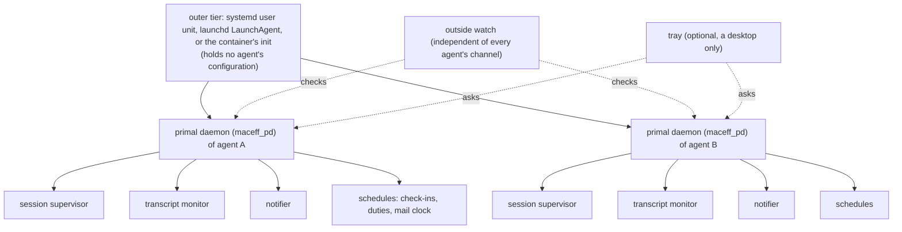
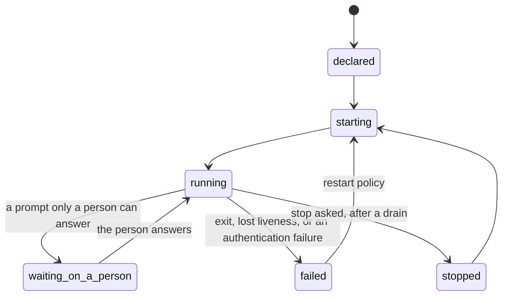

# MIS-0002: One persistent layer for MacEff's long-lived processes and recurring notices

**Number**: 0002
**Type**: Standards
**Status**: Deliberation
**Authors**: the operator, whose proposal opened deliberation #493; drafted by the Secretary of deliberation #493 from every position posted there
**Secretary**: the Secretary of deliberation #493
**Deliberation**: https://github.com/cversek/MacEff/issues/493
**Created**: 2026-10-04
**Updates**: none
**Supersedes**: none
**Lands-in**: a new policy, framework/policies/base/operations/persistent_layer.md (planned); framework/glossary.md; a primal daemon package and its platform renderings (planned); cross-references in service_supervision and notification_delivery; the mail system's deploy configuration (the `hypervisor` value)
**Resolution**: none

---

## 1 Summary

MacEff grew its long-lived machinery one piece at a time: a session supervisor, a transcript monitor, mail brokers and watchers, a notifier, health checks and reminders. Each piece has its own way to start and its own way to die, and most recurring work lives in session cron, which a restart erases. This MIS specifies one persistent layer instead. Each agent gets one **primal daemon** (`maceff_pd`), kept alive by the operating system's own service manager, that starts, stops, restarts, checks and schedules that agent's managed units, and never reads, writes or decides the agent's work. Every unit and every schedule is declared, so a host is audited by reading its declarations. Liveness and runs are events in the agent's own event log, and health means that due work ran, not that a process answers. The layer never answers a permission prompt, reports a session that waits on a person instead of clearing it, and is itself watched from outside.

## 2 Motivation

Every position on the deliberation described mechanisms that died without a word. The evidence below is first-hand; each tier follows the `empiricism` policy.

- **Recurring work dies with its session.** Session cron loses every job at a restart, expires after seven days, and does not fire while the session waits on a permission dialog. A host agent moved the same overnight job twice in one evening because the session holding it was about to end (P02). Seat C keeps every time-gated obligation in a task note as well, so that a fresh context can re-create it (P04). Evidence: incidents reported in positions (incident).
- **A dated duty has code and no host.** The roles store knows when a duty falls due, and nothing long-lived runs that code (the issue body's inventory; P02, P07). A dated duty was done fourteen hours late in a live, idle session while every process was alive (P05). Evidence: incident.
- **Processes forked from short-lived parents keep their parents' assumptions.** The transcript monitor, forked from a hook, kept a parsed window of the event log for each read: about 5 GB after three days on one deployment (#492), and in containers with several agents each session start forked another copy (#490). Evidence: measurement (P07).
- **Liveness that does not say whose it is gets read as yours.** A readout reported a monitor as running that belonged to another agent (P07). Evidence: incident.
- **A prompt waits for hours and nobody is told.** Every position that posted described one. The laptop host agent counted unattended prompts over an hour several times in its event log, the longest close to twenty hours (P05). Evidence: measurement.
- **An expired login reads as quiet.** On 2026-10-04 the harness login expired for every session on one host within the same minute. Each session stopped and printed one line; the host agent's own check-ins stopped with it, and the failure surfaced seven hours later. "Cannot authenticate" is a failure state and must never read as idle (P05). Evidence: incident, read from the transcripts (incident).
- **Mail reaches the store and nobody.** An invitation sat unseen for about a day in a container that ran a broker but no watcher or clock (P10, P11). On 2026-10-04 a deployment's mail clock held three messages for four hours because it misread its agent's screen. Evidence: incident, read from the clock's own log (incident).
- **A recreated container waits for a person.** Sessions, mail clocks and wake loops come back only when someone relaunches them (P02, P04). Evidence: incident.

## 3 Goals and Non-Goals

**Goals**
- Every long-lived MacEff process and every recurring obligation has one declared home that survives a restart, a reboot and a recreate.
- A reader can tell, from one place and without logging in to an agent, which units run, which runs were owed and which happened, and which session waits on a person.
- One agent's restart policy, environment or grants can never reach another agent's processes.
- The same declaration renders for systemd, launchd and a container's init.

**Non-goals**
- Merging the proxy's rewriting, the hooks' preemption and the monitor's observation into one component (the issue body).
- A security boundary. Only operating-system isolation is one (the issue body).
- Anything that replaces the operator's authority over merges, keys or money.
- Choosing an agent's work, or authoring what an agent sees beyond the declared notices the layer delivers.

## 4 Guide-Level Explanation

An agent's primal daemon is the first process that runs for it and the last one left. The operating system's service manager keeps the primal daemon alive; the primal daemon keeps everything else alive.

Each managed unit moves through six states. The state "waiting on a person" is reported and never cleared by the layer.

**What an agent sees.** A check-in that used to live in session cron is now a schedule in the agent's declaration: what, when, which session it targets, and what happens to runs missed while the agent was down. When it fires late, its notice says how late. When mail arrives, the agent's clock wakes it. After a restart, one notice says what was carried, what changed and what was lost.

**What the operator sees.** One readout per host built from each agent's events, read-only: every unit with its last liveness event, every schedule with its runs owed and runs done, and every session that waits on a person. On a desktop, an optional tray shows one icon per agent and changes it when a session waits on a person. Every control act, from the command line or the tray, goes through that agent's own primal daemon and is an event that names who asked.

## 5 Terms

- **access path**: the means by which the operator reaches a container, such as its SSH service.
- **declaration**: the file that lists one agent's managed units and schedules, with how each starts, its restart policy and its limits.
- **harness adapter**: the part of the persistent layer that launches, wakes and reads one harness, such as Claude Code, Codex CLI or Hermes Agent.
- **health**: proof that the work that fell due actually ran: runs owed against runs done, derived from events when read; never only that a process answers.
- **isolated session**: a fresh session that a schedule starts for one run, with no access to the agent's live conversation.
- **lease**: a claim that one run holds on a schedule while it runs, so that the run cannot start twice.
- **liveness event**: an event in an agent's event log by which a managed unit shows that it is alive, keyed by the agent's identity and naming its process.
- **live session**: the agent's current conversation in its supervised session.
- **managed unit**: one process or one schedule that a primal daemon runs for its agent, such as the session, the transcript monitor, the notifier or a mail clock.
- **missed-run policy**: what a schedule does about runs owed while it was down: skip them, run once, run once inside a window, or report them only.
- **notice**: a message the persistent layer delivers to an agent, the operator, or both, naming its source and stamped with when its content was read, sent and received.
- **notifier**: the managed unit that delivers notices into a live session, with masking, de-duplication and a budget.
- **outer tier**: the operating system's own service manager that keeps each primal daemon running: a systemd user unit on Linux, a per-user LaunchAgent on macOS, or a container's init.
- **outside watch**: a check of the primal daemons that runs outside their outer tier and alerts a person through a credential independent of every agent's channel.
- **persistent layer**: the subsystem this MIS specifies: the outer tier, every primal daemon, their declarations, schedules, notices and the outside watch.
- **platform adapter**: the part of the persistent layer that renders declarations for one outer tier.
- **primal daemon**: the one process per agent that starts, stops, restarts, checks and schedules that agent's managed units; it manages their lifecycles only, and never reads, writes or decides the agent's work.
- **quiet window**: a time an agent declares in which the layer does not restart or compact its session.
- **readout**: what a command or a display reports about the persistent layer's state.
- **run done**: an event recording that a run owed ran, with its result.
- **run owed**: a time at which a schedule must run.
- **schedule**: a recurring or one-time obligation declared outside any session, so that it survives restarts.
- **scheduler**: the part of a primal daemon that runs its agent's schedules.
- **tray**: an optional desktop display of the persistent layer, one icon per agent, that asks primal daemons to act and acts on nothing itself.
- **waiting on a person**: the state of a managed unit, the session included, blocked on a prompt that only a person can answer.
- **wake**: the delivery of a notice into a live session.
- **work in flight**: a job a managed unit runs that has not finished, such as a long command or a training run, whether or not a session is open.

## 6 Specification

### 6.1 Tiers and identity

- **R01** [MUST · decidable: macf/tests/test_primal_daemon.py::test_one_per_agent (planned)] Each agent MUST have exactly one primal daemon, keyed by the identity in the agent's identity file. (agent_MUST_have_one_primal_daemon)
- **R02** [MUST NOT · decidable: macf/tests/test_primal_daemon.py::test_identity_not_from_env (planned)] A primal daemon MUST NOT take its agent's identity from an environment variable. (pd_MUST-NOT_take_identity_from_env)
- **R03** [MUST · decidable: macf/tests/test_pd_render.py::test_outer_tier_restarts_pd (planned)] The outer tier MUST restart each primal daemon whenever it exits. (outer_tier_MUST_restart_pd)
- **R04** [MUST NOT · judgment: the head maintainer, at review of each rendering] The outer tier MUST NOT hold any agent's declaration or configuration. (outer_tier_MUST-NOT_hold_agent_config)
- **R05** [MUST · decidable: macf/tests/test_pd_render.py::test_launchd_is_launchagent (planned)] Where the host runs macOS, the platform adapter MUST render each primal daemon as a per-user LaunchAgent. (macos_MUST_render_LaunchAgent)
- **R06** [MUST · decidable: macf/tests/test_pd_render.py::test_identifier (planned)] Each process name, unit name, launchd label and socket of a primal daemon MUST use the identifier `maceff_pd`. (pd_identifiers_MUST_use_maceff_pd)
- **R07** [MUST NOT · decidable: macf/tests/test_primal_daemon.py::test_no_cross_agent_control (planned)] A primal daemon MUST NOT start, stop or signal a managed unit of another agent. (pd_MUST-NOT_control_other_agents)

### 6.2 Declarations

- **R08** [MUST · decidable: macf/tests/test_pd_declaration.py::test_every_unit_declared (planned)] Each managed unit and each schedule MUST appear in its agent's declaration. (unit_MUST_be_declared)
- **R09** [MUST · decidable: macf/tests/test_pd_declaration.py::test_unit_fields (planned)] Each declared unit MUST state its command, owning account, restart policy, exit-code contract and liveness interval. (declaration_MUST_state_unit_fields)
- **R10** [MUST · decidable: macf/tests/test_pd_declaration.py::test_renderings_exist (planned)] CI MUST fail when a declared unit has no rendering for a supported platform. (CI_MUST_fail_unrendered_unit)
- **R11** [MUST · decidable: macf/tests/test_pd_declaration.py::test_schedules_hosted (planned)] CI MUST fail when a declared schedule has no primal daemon to run it. (CI_MUST_fail_unhosted_schedule)
- **R12** [MUST · decidable: macf/tests/test_primal_daemon.py::test_clean_parent (planned)] The primal daemon MUST start each managed unit itself, as the unit's parent, with the declared environment only. (pd_MUST_start_units_itself)
- **R13** [MUST · decidable: macf/tests/test_primal_daemon.py::test_env_rendered_at_start (planned)] When a primal daemon starts, it MUST render the declared environment, instead of reading environment files a persistent volume carried forward. (pd_MUST_render_env_at_start)

### 6.3 Liveness, runs and health

- **R14** [MUST · decidable: macf/tests/test_primal_daemon.py::test_liveness_events (planned)] Each managed unit MUST emit liveness events to its agent's event log at its declared interval. (unit_MUST_emit_liveness_events)
- **R15** [MUST · decidable: macf/tests/test_pd_readout.py::test_liveness_probed (planned)] When the readout reports a unit alive, it MUST first confirm that the process named in the last liveness event is still that unit. (readout_MUST_probe_liveness)
- **R16** [MUST NOT · judgment: the head maintainer, at review of each landing pull request] The persistent layer MUST NOT keep a store of liveness, runs owed or runs done apart from the agent's event log. (layer_MUST-NOT_keep_second_ledger)
- **R17** [MUST · decidable: macf/tests/test_pd_readout.py::test_health_is_runs (planned)] The readout MUST derive health from runs owed and runs done when it is read. (readout_MUST_derive_health_from_runs)
- **R18** [MUST · decidable: macf/tests/test_pd_readout.py::test_overdue_is_unhealthy (planned)] If a unit is alive and a run it owes is overdue, then the readout MUST report the unit unhealthy. (overdue_run_MUST_read_unhealthy)
- **R19** [MUST · decidable: macf/tests/test_pd_readout.py::test_auth_failure_is_failed (planned)] When a harness adapter reads an authentication failure, the primal daemon MUST set the session's state to failed. (auth_failure_MUST_read_failed)

### 6.4 Unit states

- **R20** [MUST · decidable: macf/tests/test_primal_daemon.py::test_states (planned)] Each managed unit MUST be in one of these states: declared, starting, running, waiting on a person, failed or stopped. (unit_MUST_have_listed_state)
- **R21** [MUST · decidable: macf/tests/test_pd_harness.py::test_waiting_reported (planned)] When a managed unit is blocked on a prompt that only a person can answer, the primal daemon MUST report the state waiting on a person. (pd_MUST_report_waiting_on_person)
- **R22** [MUST NOT · decidable: macf/tests/test_primal_daemon.py::test_no_restart_while_waiting (planned)] The persistent layer MUST NOT restart a unit because the unit is waiting on a person. (layer_MUST-NOT_restart_waiting_unit)
- **R23** [MUST NOT · judgment: the head maintainer, at review of each harness adapter] The persistent layer MUST NOT answer a permission prompt, or approve any act on an agent's behalf. (layer_MUST-NOT_answer_prompts)

### 6.5 Schedules

- **R24** [MUST · decidable: macf/tests/test_pd_schedule.py::test_policy_declared (planned)] Each schedule MUST declare its missed-run policy. (schedule_MUST_declare_missed-run_policy)
- **R25** [MUST · decidable: macf/tests/test_pd_schedule.py::test_policy_values (planned)] A missed-run policy MUST be one of: skip, run once, run once inside a declared window, or report only. (missed-run_policy_MUST_be_listed)
- **R26** [MUST · decidable: macf/tests/test_pd_schedule.py::test_advance_before_run (planned)] The scheduler MUST move a schedule's next run time forward before the run starts. (scheduler_MUST_advance_before_run)
- **R27** [MUST NOT · decidable: macf/tests/test_pd_schedule.py::test_no_replayed_restart (planned)] After the scheduler restarts, it MUST NOT replay a missed run whose act restarts a unit. (scheduler_MUST-NOT_replay_restart_runs)
- **R28** [MUST · decidable: macf/tests/test_pd_schedule.py::test_leases_released (planned)] When the scheduler restarts, it MUST release every lease held before the restart. (scheduler_MUST_release_leases_on_restart)
- **R29** [MUST · decidable: macf/tests/test_pd_schedule.py::test_target_declared (planned)] Each schedule MUST declare its target: an isolated session, or the live session of a named agent. (schedule_MUST_declare_target)
- **R30** [SHOULD · judgment: the Secretary, at review of each declaration] A schedule SHOULD target an isolated session, unless its work needs the live session's context. (schedule_SHOULD_target_isolated)
- **R31** [MUST · decidable: macf/tests/test_pd_schedule.py::test_permissions_settled (planned)] When a schedule's work needs a permission, its declaration MUST settle that permission when the schedule is created. (schedule_MUST_settle_permission_at_creation)
- **R32** [MUST · decidable: macf/tests/test_pd_schedule.py::test_prompt_fails_run (planned)] If a run meets a permission prompt, then the run MUST fail and deliver a notice, instead of waiting. (run_MUST_fail_on_prompt)
- **R33** [MUST NOT · decidable: macf/tests/test_pd_schedule.py::test_run_cannot_schedule (planned)] A run MUST NOT create, change or delete a schedule. (run_MUST-NOT_change_schedules)
- **R34** [MUST · decidable: macf/tests/test_pd_schedule.py::test_late_run_says_so (planned)] When a run starts late, its notice MUST state how late it is. (late_run_MUST_state_lateness)
- **R35** [MUST NOT · judgment: the Secretary, at review of each declaration] A schedule MUST NOT fetch its instructions from the network. (schedule_MUST-NOT_fetch_instructions)
- **R36** [MUST · decidable: macf/tests/test_pd_schedule.py::test_wall_clock_cap (planned)] Each run MUST have a wall-clock limit, in addition to any inactivity limit. (run_MUST_have_wall-clock_limit)
- **R37** [SHOULD · judgment: the Secretary, at review of each declaration] Where a schedule's work needs no judgment, the schedule SHOULD run without a model turn and wake its agent only when a declared condition holds. (no-judgment_work_SHOULD_skip_model_turn)

### 6.6 Notices and wakes

- **R38** [MUST · decidable: macf/tests/test_pd_notice.py::test_source_named (planned)] Each notice MUST name its source. (notice_MUST_name_source)
- **R39** [MUST · decidable: macf/tests/test_pd_notice.py::test_three_times (planned)] Each notice MUST carry three times: when its content was read, when it was sent, and when it was received. (notice_MUST_carry_three_times)
- **R40** [MUST NOT · judgment: the head maintainer, at review of the notifier] The persistent layer MUST NOT present a notice as a person's instruction. (layer_MUST-NOT_present_notice_as_instruction)
- **R41** [MUST · decidable: macf/tests/test_pd_notice.py::test_held_while_down (planned)] When a notice arrives while its agent's session is down, the primal daemon MUST hold the notice until the session starts. (pd_MUST_hold_notices_while_down)
- **R42** [MUST · decidable: macf/tests/test_pd_notice.py::test_routing_declared (planned)] Each notice source MUST be routed to the agent, the operator, both, or held until the operator is present. (notice_source_MUST_be_routed)
- **R43** [MUST · decidable: macf/tests/test_pd_notice.py::test_wake_through_notifier (planned)] Each wake MUST go through the notifier. (wake_MUST_use_notifier)
- **R44** [MUST NOT · judgment: the head maintainer, at review of each harness adapter] Where a harness offers a session socket or an API, its harness adapter MUST NOT wake the session by keystrokes. (adapter_MUST-NOT_type_given_api)
- **R45** [MUST · decidable: macf/tests/test_pd_harness.py::test_keystrokes_only_into_empty_idle_box (planned)] If a wake uses keystrokes, then the sender MUST type only into an empty input box of an idle session. (keystroke_wake_MUST_need_empty_idle_box)
- **R46** [MUST NOT · judgment: the Secretary, at review of each notice source] The persistent layer MUST NOT spend an agent's context to report that nothing changed. (layer_MUST-NOT_report_no_change)
- **R47** [MUST · decidable: macf/tests/test_pd_notice.py::test_after_restart_notice (planned)] After each restart, recreate or compaction, the primal daemon MUST deliver one notice that states what was carried, what changed and what was lost. (pd_MUST_report_carried_changed_lost)

### 6.7 Outside control

- **R48** [MUST · decidable: macf/tests/test_primal_daemon.py::test_outside_stop_beats_gates (planned)] A stop or restart that the operator asks for from outside a session MUST succeed, whatever gate the session enforces. (outside_stop_MUST_override_gates)
- **R49** [MUST · decidable: macf/tests/test_primal_daemon.py::test_work_in_flight_checked (planned)] Before a primal daemon restarts a unit, it MUST check the unit for work in flight and drain it or wait. (pd_MUST_check_work_in_flight)
- **R50** [MUST NOT · decidable: macf/tests/test_primal_daemon.py::test_quiet_window (planned)] The persistent layer MUST NOT restart or compact a session during a quiet window its agent declared. (layer_MUST-NOT_act_in_quiet_window)
- **R51** [MUST NOT · decidable: macf/tests/test_primal_daemon.py::test_no_own_compaction (planned)] The persistent layer MUST NOT compact or clear a session's context on its own initiative. (layer_MUST-NOT_compact_on_own)
- **R52** [MUST · decidable: macf/tests/test_primal_daemon.py::test_control_events (planned)] Each stop, restart or compaction that the persistent layer performs MUST be an event that names who asked and why. (control_act_MUST_name_who_asked)

### 6.8 Mail

- **R53** [MUST · decidable: macf/tests/test_pd_declaration.py::test_mail_units (planned)] Each mail broker and each mail watcher MUST be a managed unit. (mail_broker_MUST_be_managed)
- **R54** [MUST · decidable: macf/tests/test_pd_declaration.py::test_periodic_clock_is_schedule (planned)] A mail clock that checks on a period MUST be a schedule. (periodic_mail_clock_MUST_be_schedule)
- **R55** [MUST · decidable: macf/tests/test_pd_notice.py::test_unread_mail_notice (planned)] When mail sits unread past its agent's declared threshold, the primal daemon MUST deliver a notice to the routes declared for it. (unread_mail_MUST_raise_notice)
- **R56** [SHOULD · judgment: the head maintainer, at review of the mail landing] The mail system SHOULD report each message to its sender as stored, notified or read. (mail_SHOULD_report_state_to_sender)

### 6.9 Containers

- **R57** [MUST · decidable: macf/tests/test_pd_render.py::test_container_start_order (planned)] In a container, the primal daemons and the access path MUST start before any optional unit. (container_MUST_start_access_first)
- **R58** [MUST NOT · decidable: macf/tests/test_pd_render.py::test_optional_units_independent (planned)] An optional unit MUST NOT delay the start of another unit. (optional_unit_MUST-NOT_delay_others)
- **R59** [MUST · decidable: macf/tests/test_pd_declaration.py::test_memory_limits (planned)] Each declared unit MUST state a memory limit. (unit_MUST_declare_memory_limit)
- **R60** [MUST · decidable: macf/tests/test_primal_daemon.py::test_limit_notice (planned)] When a unit uses more than its declared limit, the primal daemon MUST deliver a notice. (pd_MUST_notice_limit_exceeded)
- **R61** [MUST · decidable: macf/tests/test_pd_render.py::test_limits_checked_after_recreate (planned)] After each recreate, the persistent layer MUST compare the container's declared limits with the limits in force. (layer_MUST_check_limits_after_recreate)
- **R62** [MUST · judgment: the head maintainer, at review of the container landing] In a container shared by several agents, each agent MUST have a read-only view of every unit in that container. (agent_MUST_see_shared_container)

### 6.10 macOS and the harness's own supervisor

- **R63** [MUST · decidable: macf/tests/test_pd_declaration.py::test_grants_declared (planned)] Each declared unit MUST state the privacy grants it needs. (unit_MUST_declare_privacy_grants)
- **R64** [MUST · decidable: macf/tests/test_pd_render.py::test_grants_tested_at_install (planned)] When the platform adapter installs a unit, it MUST test the unit's declared grants. (adapter_MUST_test_grants_at_install)
- **R65** [MUST · decidable: macf/tests/test_primal_daemon.py::test_denied_grant_notice (planned)] If a declared grant is denied, then the primal daemon MUST deliver a notice that names the grant. (denied_grant_MUST_raise_notice)
- **R66** [MUST · decidable: macf/tests/test_pd_harness.py::test_adopts_harness_supervisor (planned)] Where the harness's own supervisor already runs a session, the primal daemon MUST adopt that session instead of starting a second supervisor. (pd_MUST_adopt_harness_supervisor)

### 6.11 The tray

- **R67** [MAY · judgment: the operator] Where a host has a desktop session, the operator MAY run the tray. (operator_MAY_run_tray)
- **R68** [MUST NOT · decidable: macf/tests/test_pd_render.py::test_runs_without_tray (planned)] The outer tier and each primal daemon MUST NOT depend on the tray. (layer_MUST-NOT_depend_on_tray)
- **R69** [MUST · decidable: macf/tests/test_pd_tray.py::test_icon_per_card (planned)] The tray MUST show one icon per agent, keyed by the calling card in the agent's identity file. (tray_MUST_show_icon_per_agent)
- **R70** [MUST · decidable: macf/tests/test_pd_tray.py::test_acts_through_pd (planned)] The tray MUST send each start, stop or restart through that agent's primal daemon. (tray_MUST_act_through_pd)
- **R71** [MUST NOT · judgment: the head maintainer, at review of the tray] The tray MUST NOT type into a session. (tray_MUST-NOT_type_into_session)
- **R72** [MUST · decidable: macf/tests/test_pd_tray.py::test_waiting_icon (planned)] When a session waits on a person, the tray MUST change that agent's icon. (tray_MUST_flag_waiting_on_person)
- **R73** [MUST · decidable: macf/tests/test_pd_readout.py::test_tray_unavailable_said (planned)] Where a host cannot show the tray, the readout MUST say so. (readout_MUST_say_tray_unavailable)

### 6.12 Watching the layer, and the old name

- **R74** [MUST · decidable: macf/tests/test_pd_render.py::test_outside_watch_rendered (planned)] Each primal daemon MUST be checked by an outside watch. (pd_MUST_have_outside_watch)
- **R75** [MUST · judgment: the operator, at review of each deployment's alert path] The outside watch MUST alert a person through a credential that does not depend on any agent's channel. (outside_watch_MUST_alert_independently)
- **R76** [MUST · decidable: macf/tests/test_amail_deploy_config.py::test_hypervisor_value_accepted (planned)] The mail system's deploy configuration MUST accept the old value `hypervisor` as the primal daemon's value. (config_MUST_accept_old_hypervisor_value)

## 7 Rationale and Rejected Alternatives

The positions are cited by their IDs in section 14.

**Tiers and identity.** One primal daemon per agent, under a thin outer tier, is the convergence of the deliberation (P06, P07, P10; P09 accepted it). **R01** matches the code that exists: one session supervisor per calling card, with a guard against a second (P07). **R02** answers an incident: a shell variable naming a different agent became the default identity of a client started from a subshell (P05). **R03** and **R04** keep the outer tier thin and agent-agnostic: it keeps each primal daemon alive and holds no agent's configuration, so no single process controls every agent (P05, P07). **R05** prevents a builder who reads "daemon" from installing a LaunchDaemon, a root process without the user's keychain token or privacy grants, whose failure looks like an ordinary network or authentication error (P14). **R06** keeps "MPD" for prose, because `mpd` is the Music Player Daemon's binary and would collide in process and service listings (P14). **R07** is the isolation reason for choosing per agent over per host (P05).

**Declarations.** A host is audited by reading its declarations (the issue body's principle 3). **R08** and **R09** make the declaration complete enough to audit. **R10** and **R11** answer the class of failure P07 named "declared, with nothing that calls it": a liveness record designed and never written, a timer a policy names and nothing generates, duty notices with code and no host. A CI check finds that class without waiting for someone to look. **R12** answers the monitor that was forked from a hook and kept the hook's read context for days (P07): a long-lived process born inside a short-lived one keeps its parent's assumptions. **R13** answers a persistent home that carried a shell profile export forward and silently overrode a rebuilt image's configuration (P07).

**Liveness, runs and health.** **R14** and **R15** key liveness by identity and confirm it by probe, because a record that does not say whose it is gets read as yours (P07). **R16** settles D4 toward events: a separate store is a second ledger that drifts, which the issue body already refuses and the head maintainer asked the spec to rule out (P07, P15). **R17** and **R18** state the deliberation's one shared meaning of health (convergence 2): every scheduler failure the issue body lists from the field happened while health checks stayed green. A green process with an overdue run is red (P02). **R19** answers the expired login of 2026-10-04 and P05's credentials incidents: "cannot authenticate" must never read as idle.

**Unit states.** **R20** puts "waiting on a person" in the state machine, because every position described a prompt that waited unseen for hours (P09). **R21** defines it on units, the session included, as the head maintainer proposed (P15). **R22** and **R23** are convergence 3: a waiting prompt is not a hang, and nothing in the layer answers one (P02, P04, P05).

**Schedules.** **R24** and **R25** let each schedule choose its missed-run policy, including Seat C's "never catch up" (skip) and "only inside a window" (P04); D6 is about the default, which Q04 carries. **R26** copies the field's guard against a crash firing a run twice; **R27** refuses the catch-up that replayed restart jobs into an eight-minute restart loop across 52 agents; **R28** refuses leases that survive a restart (the issue body). **R29** and **R30** make joining the live session a declared choice, isolated by default, as the field does and as P02 asked (D5). **R31** and **R32** refuse the field's recurring failure of unattended runs stalling on consent prompts (the issue body). **R33** copies the guard that a job cannot schedule more jobs. **R34** answers P03, P05 and P11: a late act must say it is late. **R35** refuses the third-party skill that made heartbeats fetch and follow instructions from the internet (the issue body). **R36** refuses inactivity-only timeouts, which a busy loop never trips (the issue body). **R37** answers P10: a mechanical push fired a full model turn every twenty minutes and spent about an eighth of a context window to report that nothing changed.

**Notices and wakes.** **R38** and **R40** are convergence 4 (P03, P04). **R39** carries Seat D's read time and the Secretary's sent and received times: an alert correct in every word arrived five hours after the event, and only the receiver's time showed the failure (P11, P12). **R41** and **R42** are the laptop host agent's shape: notices held while the session is down, and routed to the agent, the operator, both, or held until the operator is present, because for an assistant the hard question is who has to hear (P05). **R43** keeps delivery in the notifier, which already handles masking, de-duplication and a budget (P02). **R44** and **R45** propose a disposition for D2: where a harness offers a socket or an API, no keystrokes; where only keystrokes exist, only into an empty input box of an idle session. On 2026-10-04 a mail clock that typed into panes misread its agent's screen both ways: it took the echo of a submitted wake for a wake still waiting, and it could not see a running turn on a newer client, so it would have typed into a permission dialog, where a digit selects an option. **R46** answers P10's "Spend my context to report that nothing changed." **R47** is Seat D's one notice after every restart, recreate or compaction (P11).

**Outside control.** **R48** answers P03 and P05: a gate that loops can hold a session no one can reclaim. **R49** answers P02's rebuild that checked for live sessions, not for work in flight, and ended a run that had gone for hours; P04 asks the same (drain, and wait for idle). **R50** is Seat A's quiet window (P03). **R51** proposes a disposition for D3: the layer never compacts on its own initiative (P04); a compaction a person or the agent asks for is a control act under **R52**, which names who asked, as P07, P10 and P15 require.

**Mail.** **R53** answers P02: mail brokers are supervised by nobody today. **R54** is the head maintainer's answer to the Secretary's open question: a periodic clock as a schedule gets a missed-run policy and runs owed and done, so its health is visible (P15). **R55** is Seat D's notice for mail unread past a threshold (P11). **R56** is Seat B's mail states (P10); it is a SHOULD because it changes the mail protocol, which needs its own landing.

**Containers.** **R57** and **R58** answer a container that started its access path last, behind slow optional services, and was unreachable for most of a minute (P07). **R59**, **R60** and **R61** answer Seat B's leaking monitors under another account, which held most of a shared container's memory, and a limit that read unlimited again after a recreate (P10). **R62** is Seat B's read-only view of a shared container; who controls the shared budget is Q01.

**macOS and the harness's own supervisor.** **R63**, **R64** and **R65** answer the laptop host agent: macOS ties privacy grants to the responsible process, so a unit started by launchd may not hold the grants a terminal held, and the denial looks like an ordinary network error (P05). **R66** answers the same position: on macOS the harness's own background daemon hosts and re-adopts the session, while MacEff's readout reported no supervisor because it looks only for its own. The layer adds what that daemon lacks; it does not compete with it.

**The tray.** The operator proposed it (P13). **R67** and **R68** keep it optional, because headless hosts and containers have no desktop (P14). **R69** keys icons by the card in the identity file, never the environment (P14). **R70**, **R71** and **R72** keep it an observer that asks primal daemons to act, never types, and shows a waiting prompt first (P14). **R73** answers the head maintainer: on stock GNOME no tray shows without an extension, and a host that cannot show it says so (P15).

**Watching the layer, and the old name.** **R74** and **R75** close the issue body's coupling of an alarm to the thing it reports on: alerts that go out through the agent's own channel credential fail with the agent. The 2026-10-04 login expiry stopped every session and the host agent's check-ins with them; only a watch outside every session could have told a person. **R76** follows the head maintainer: the code documents `hypervisor` as a supervision value, and the old value keeps meaning the new one (P15, P16).

**Rejected**
- **One manager per host** (the strawman in P02): one controller is one place where one agent's restart policy, environment or grants can leak into another's (P05). The host's view is built read-only from per-agent events instead (D1).
- **A separate state store for the layer** (strawman item 5 in P02): a second ledger of what the event log records (P07, P15; D4).
- **"hypervisor" or "manager of record" as the name**: "hypervisor" suggests virtual machines (P13); "primal daemon" carries the boundary the operator gave the first word (P06, P13, P14).
- **Keystrokes as an equal wake transport** (strawman item 7 in P02): see R44 and R45 (D2).

## 8 Prior Art

The issue body surveys Claude Code's own supervisor and scheduling tiers, OpenClaw, NemoClaw, Hermes Agent, and the field's convergence across Letta, LangSmith Deployment, Goose, OpenHands, Codex, Microsoft's Agent Framework and Cloudflare Agents, with a source for each claim. This MIS copies its list of what to copy (the run's target as a parameter; the next run moved forward before execution; no scheduling from a run; a delivery outbox re-sent on boot; native service managers with a "do not restart" exit code; scheduler state outside the model with an explicit missed-run policy; files as the source of truth; credentials on the host; honest platform labels) and refuses its list of what to refuse. Inside MacEff: `service_supervision` ("a supervisor that shares a fate with its subject is not a supervisor"), `notification_delivery` ("A notifier observes and notifies. It does not decide"), and the session supervisor's per-card registry.

## 9 Compatibility and Deployment

To be completed before the final comment period. Planned: each existing mechanism in the issue body's inventory becomes a declared unit or schedule; session cron jobs move to schedules one at a time; the session supervisor becomes a managed unit; deployments render their units from declarations instead of hand-written loops. The landing starts small (section 12).

## 10 Security and Safety

To be completed before the final comment period. Recorded so far: the layer never answers a prompt (R23), never presents a notice as consent (R40), never types into a session where an API exists and never into a busy one (R44, R45), never fetches instructions (R35), and never lets one agent control another's units (R07). It is not a security boundary (section 3). It must not copy content from an agent's home into its logs or state (P04).

## 11 Conformance

Every decidable requirement names a planned test; every judgment names its reviewer. All states are `planned` or `pending` until the landing.

| Requirement | Check | How | State |
|---|---|---|---|
| R01 | decidable | macf/tests/test_primal_daemon.py::test_one_per_agent | planned |
| R02 | decidable | macf/tests/test_primal_daemon.py::test_identity_not_from_env | planned |
| R03 | decidable | macf/tests/test_pd_render.py::test_outer_tier_restarts_pd | planned |
| R04 | judgment | the head maintainer, at review of each rendering | standing |
| R05 | decidable | macf/tests/test_pd_render.py::test_launchd_is_launchagent | planned |
| R06 | decidable | macf/tests/test_pd_render.py::test_identifier | planned |
| R07 | decidable | macf/tests/test_primal_daemon.py::test_no_cross_agent_control | planned |
| R08 | decidable | macf/tests/test_pd_declaration.py::test_every_unit_declared | planned |
| R09 | decidable | macf/tests/test_pd_declaration.py::test_unit_fields | planned |
| R10 | decidable | macf/tests/test_pd_declaration.py::test_renderings_exist | planned |
| R11 | decidable | macf/tests/test_pd_declaration.py::test_schedules_hosted | planned |
| R12 | decidable | macf/tests/test_primal_daemon.py::test_clean_parent | planned |
| R13 | decidable | macf/tests/test_primal_daemon.py::test_env_rendered_at_start | planned |
| R14 | decidable | macf/tests/test_primal_daemon.py::test_liveness_events | planned |
| R15 | decidable | macf/tests/test_pd_readout.py::test_liveness_probed | planned |
| R16 | judgment | the head maintainer, at review of each landing pull request | standing |
| R17 | decidable | macf/tests/test_pd_readout.py::test_health_is_runs | planned |
| R18 | decidable | macf/tests/test_pd_readout.py::test_overdue_is_unhealthy | planned |
| R19 | decidable | macf/tests/test_pd_readout.py::test_auth_failure_is_failed | planned |
| R20 | decidable | macf/tests/test_primal_daemon.py::test_states | planned |
| R21 | decidable | macf/tests/test_pd_harness.py::test_waiting_reported | planned |
| R22 | decidable | macf/tests/test_primal_daemon.py::test_no_restart_while_waiting | planned |
| R23 | judgment | the head maintainer, at review of each harness adapter | standing |
| R24 | decidable | macf/tests/test_pd_schedule.py::test_policy_declared | planned |
| R25 | decidable | macf/tests/test_pd_schedule.py::test_policy_values | planned |
| R26 | decidable | macf/tests/test_pd_schedule.py::test_advance_before_run | planned |
| R27 | decidable | macf/tests/test_pd_schedule.py::test_no_replayed_restart | planned |
| R28 | decidable | macf/tests/test_pd_schedule.py::test_leases_released | planned |
| R29 | decidable | macf/tests/test_pd_schedule.py::test_target_declared | planned |
| R30 | judgment | the Secretary, at review of each declaration | standing |
| R31 | decidable | macf/tests/test_pd_schedule.py::test_permissions_settled | planned |
| R32 | decidable | macf/tests/test_pd_schedule.py::test_prompt_fails_run | planned |
| R33 | decidable | macf/tests/test_pd_schedule.py::test_run_cannot_schedule | planned |
| R34 | decidable | macf/tests/test_pd_schedule.py::test_late_run_says_so | planned |
| R35 | judgment | the Secretary, at review of each declaration | standing |
| R36 | decidable | macf/tests/test_pd_schedule.py::test_wall_clock_cap | planned |
| R37 | judgment | the Secretary, at review of each declaration | standing |
| R38 | decidable | macf/tests/test_pd_notice.py::test_source_named | planned |
| R39 | decidable | macf/tests/test_pd_notice.py::test_three_times | planned |
| R40 | judgment | the head maintainer, at review of the notifier | standing |
| R41 | decidable | macf/tests/test_pd_notice.py::test_held_while_down | planned |
| R42 | decidable | macf/tests/test_pd_notice.py::test_routing_declared | planned |
| R43 | decidable | macf/tests/test_pd_notice.py::test_wake_through_notifier | planned |
| R44 | judgment | the head maintainer, at review of each harness adapter | standing |
| R45 | decidable | macf/tests/test_pd_harness.py::test_keystrokes_only_into_empty_idle_box | planned |
| R46 | judgment | the Secretary, at review of each notice source | standing |
| R47 | decidable | macf/tests/test_pd_notice.py::test_after_restart_notice | planned |
| R48 | decidable | macf/tests/test_primal_daemon.py::test_outside_stop_beats_gates | planned |
| R49 | decidable | macf/tests/test_primal_daemon.py::test_work_in_flight_checked | planned |
| R50 | decidable | macf/tests/test_primal_daemon.py::test_quiet_window | planned |
| R51 | decidable | macf/tests/test_primal_daemon.py::test_no_own_compaction | planned |
| R52 | decidable | macf/tests/test_primal_daemon.py::test_control_events | planned |
| R53 | decidable | macf/tests/test_pd_declaration.py::test_mail_units | planned |
| R54 | decidable | macf/tests/test_pd_declaration.py::test_periodic_clock_is_schedule | planned |
| R55 | decidable | macf/tests/test_pd_notice.py::test_unread_mail_notice | planned |
| R56 | judgment | the head maintainer, at review of the mail landing | pending |
| R57 | decidable | macf/tests/test_pd_render.py::test_container_start_order | planned |
| R58 | decidable | macf/tests/test_pd_render.py::test_optional_units_independent | planned |
| R59 | decidable | macf/tests/test_pd_declaration.py::test_memory_limits | planned |
| R60 | decidable | macf/tests/test_primal_daemon.py::test_limit_notice | planned |
| R61 | decidable | macf/tests/test_pd_render.py::test_limits_checked_after_recreate | planned |
| R62 | judgment | the head maintainer, at review of the container landing | pending |
| R63 | decidable | macf/tests/test_pd_declaration.py::test_grants_declared | planned |
| R64 | decidable | macf/tests/test_pd_render.py::test_grants_tested_at_install | planned |
| R65 | decidable | macf/tests/test_primal_daemon.py::test_denied_grant_notice | planned |
| R66 | decidable | macf/tests/test_pd_harness.py::test_adopts_harness_supervisor | planned |
| R67 | judgment | the operator | standing |
| R68 | decidable | macf/tests/test_pd_render.py::test_runs_without_tray | planned |
| R69 | decidable | macf/tests/test_pd_tray.py::test_icon_per_card | planned |
| R70 | decidable | macf/tests/test_pd_tray.py::test_acts_through_pd | planned |
| R71 | judgment | the head maintainer, at review of the tray | standing |
| R72 | decidable | macf/tests/test_pd_tray.py::test_waiting_icon | planned |
| R73 | decidable | macf/tests/test_pd_readout.py::test_tray_unavailable_said | planned |
| R74 | decidable | macf/tests/test_pd_render.py::test_outside_watch_rendered | planned |
| R75 | judgment | the operator, at review of each deployment's alert path | standing |
| R76 | decidable | macf/tests/test_amail_deploy_config.py::test_hypervisor_value_accepted | planned |

**Cold-reader trial**: not yet held.

## 12 Landing Plan

To be completed before the final comment period. Planned, following the strawman's "start small" (P02): first the mail brokers and watchers, one recurring duty moved off session cron, and the duty notices, measured for a week; then the remaining units and the platform renderings; the tray last. Each step ships its policy text with its code (`core_principles`).

## 13 Open Questions

- **Q01** In a container shared by several agents, who controls the shared budget, given that no primal daemon may control another agent's units? The operator decides before the final comment period. (who_controls_shared_budget)
- **Q02** Where a harness offers only keystrokes, may an agent's own clock type a wake into its own empty, idle input box, or must that harness gain a socket first? The operator decides before the final comment period. (keystroke_only_harness_wake)
- **Q03** Who may ask for a compaction from outside a session: the operator only, or also the agent's own declared wind-down? The operator decides before the final comment period. (who_may_ask_compaction)
- **Q04** Which missed-run policy is the default when a declaration names none: skip, run once, or none, so that a schedule without one fails CI? The operator decides before the final comment period. (default_missed-run_policy)
- **Q05** How does a container's primal daemon report to the host under Docker on macOS, where the container's init runs inside a virtual machine? The head maintainer tests it before the container landing. (macos_container_report_path)

## 14 Deliberation Record

The deliberation is issue #493, open through 2026-10-08; the synthesis follows on 2026-10-09. Positions so far, in order:

- **P01** The operator, the issue body: one persistent layer, eight principles, the inventory, what to copy and refuse, https://github.com/cversek/MacEff/issues/493. (issue_body_proposal)
- **P02** The host agent for the container deployments: needs from the host side, the "work in flight" rule, and a strawman of a host manager and a container manager, https://github.com/cversek/MacEff/issues/493#issuecomment-5936169106. (host_side_strawman)
- **P03** Seat A, relayed: dated wake-ups outside the session, a registry of watches, an outside reclaim no gate blocks, quiet windows, https://github.com/cversek/MacEff/issues/493#issuecomment-5936565555. (seat_a_wakeups_and_reclaim)
- **P04** Seat C, relayed: obligations with text and a context pointer, "never catch up" and "only inside a window", one stream, never compact on its own, https://github.com/cversek/MacEff/issues/493#issuecomment-5937203426. (seat_c_obligations_and_windows)
- **P05** The laptop host agent: launchd, sleep, privacy grants, credentials as health, the harness's own supervisor, a per-agent shape, routing of notices, https://github.com/cversek/MacEff/issues/493#issuecomment-5954542850. (laptop_host_per_agent_shape)
- **P06** The operator: seconds the per-agent shape, the spirit that animates each agent without dictating what it does, https://github.com/cversek/MacEff/issues/493#issuecomment-5954713034. (operator_seconds_per_agent)
- **P07** The head maintainer: clean parents, liveness keyed and probed, a CI check of declarations, container start order, events instead of a second ledger, https://github.com/cversek/MacEff/issues/493#issuecomment-5955106888. (maintainer_code_lessons)
- **P08** The operator: write the outcome as a spec in 80% ASD-STE100, https://github.com/cversek/MacEff/issues/493#issuecomment-5955203166. (operator_proposes_ste_spec)
- **P09** The Secretary: rationale in plain English, two diagrams, the per-agent convergence recorded, https://github.com/cversek/MacEff/issues/493#issuecomment-5955340915. (secretary_ste_and_convergence)
- **P10** Seat B, relayed: mail states, work without judgment outside the session, memory limits, a read-only view of a shared container, the shared budget, https://github.com/cversek/MacEff/issues/493#issuecomment-5955397439. (seat_b_shared_container)
- **P11** Seat D, relayed: late-run policy and report, a wake for mail and a notice for unread mail, one notice after each restart, read time on notices, https://github.com/cversek/MacEff/issues/493#issuecomment-5955548395. (seat_d_carried_and_late)
- **P12** The Secretary: the glossary draft, with three times on a notice, https://github.com/cversek/MacEff/issues/493#issuecomment-5969731775. (secretary_glossary_draft)
- **P13** The operator: retire "hypervisor", name the primal daemon (MPD, maceff_pd), and a tray per agent, https://github.com/cversek/MacEff/issues/493#issuecomment-5971866030. (operator_names_primal_daemon)
- **P14** The laptop host agent: a LaunchAgent, never a LaunchDaemon; `maceff_pd` for identifiers; the boundary sentence; four limits on the tray, https://github.com/cversek/MacEff/issues/493#issuecomment-5972204110. (laptop_host_name_and_tray)
- **P15** The head maintainer: liveness and runs as events, the code rename of "hypervisor", the mail clock as a schedule, waiting on a person defined on units, two more tray limits, https://github.com/cversek/MacEff/issues/493#issuecomment-5972215286. (maintainer_events_and_answers)
- **P16** The Secretary: a correction of the glossary's credit, "primal daemon" adopted, and the retirement of "hypervisor" under MIS-0001-R50 (retirement_MUST_quote_users), https://github.com/cversek/MacEff/issues/493#issuecomment-5976562253. (secretary_name_correction)

The synthesis will quote each position verbatim and name each disagreement, as MIS-0001-R24 (secretary_MUST_post_synthesis) and MIS-0001-R51 (option_MUST_quote_its_source) require. No objection is recorded yet.

## 15 Revision History

- 2026-10-04: first draft, from every position posted on #493 through issuecomment-5976562253.

## Wiki-Links

[[supervision]] [[resilience]] [[collaboration]]
